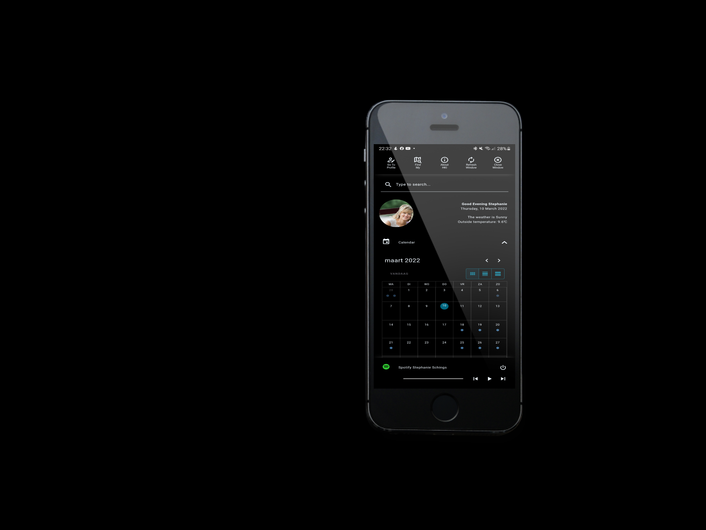
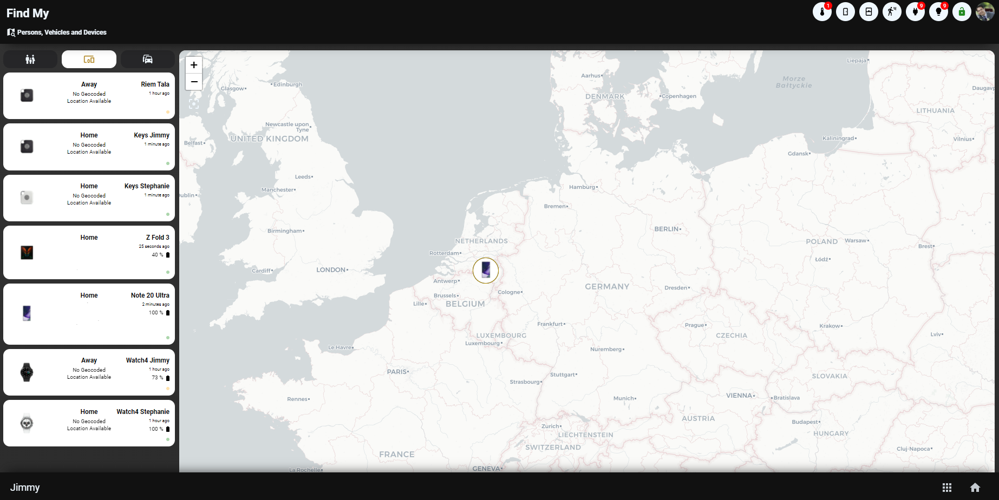

## Homekit Infused 5 (Lovelace) by Jimz011

This is Homekit Infused 5, a complete lovelace dashboard solution for Home Assistant. 
In a nutshell Homekit Infused will turn your Home Assistant dashboard into a Homekit styled variant with a beautiful header which gives a more tablet/phone app style to your dashboard.

Note: Homekit Infused is a YAML style dashboard, this means that a basic understanding of YAML is advised. However if you follow the documentation/video tutorials you should be able to create a dashboard nonetheless. You should be able to create a beautiful dashboard without too much effort!

Homekit Infused does NOT replace any of your existing dashboards so you can rest assured that installing HKI will not destroy any of your existing dashboards. You can use Homekit Infused in conjunction with other dashboards.

In short Homekit Infused 5 is all of the below and much much more!
- Having trouble convincing your partner to use HA? HKI has a really amazing WAF!
- A beautiful header with notifications that is customizable per view and is added to each view for you automatically.
- A customizable navigation bar which can also be set at the bottom of the screen.
- An automatically created menu.
- Create new views super fast by only defining a view name, title and icon. Just these lines will create a new view, a menu entry, a navigation bar button and icon and a header title, cool huh?
- 2 Fully customizable themes where you can change the entire look and feel of Homekit Infused in REAL-TIME!
- Share your own created themes with the HKI community by creating scripts, the best themes will be added to future HKI releases!
- A LOT of preconfigured addons which you can add to any of your views, by default all addons are preconfigured for fast dashboard creation.
- Custom addon which allows you to use ANY home assistant card available either core or community created cards.
- A fully customizable per user profile menu.
- A fully customizable Alarm panel.
- Known to be one of the best documented dashboards around, HKI 5 is no different and even better!
- Experienced users can go fully custom YAML on a per view basis (this is particularly useful for HKI 3 and 4 users that want to migrate)
- Easy updates, copy/replace 2 folders on each update!
- Blazing fast frontend, even with large setups (watch my video's to see it in action).
- Over 200+ new settings compared to HKI 4!
- And MUCH MUCH I mean MUCH more!

*Note: None of the custom-cards used in this project are made by me and every custom-card used has a reference to their original creators as well as the original link to their repo's. All contributors/donators and people that gave me the inspiration are mentioned in the docs on the last page!

### Quick Links
#### [Click here](https://jimz011.github.io/homekit-infused/) for the documentation
#### [Click here](https://github.com/jimz011/homekit-infused/releases) to download the latest release
#### [Click here](docs/addons.md) for addons
#### [Click here](https://github.com/jimz011/homekit-infused/tree/5.x.x-personal/) to view how my personal Home Assistant is setup for HKI 5
#### [Click here](https://github.com/jimz011/homekit-infused/tree/4.x.x-docs) if you were looking for Homekit Infused 4

### Support Links
#### [Click here](https://www.youtube.com/jimz011) for my YouTube channel
#### [Click here](https://www.youtube.com/playlist?list=PLezjWQmPsNpF9zNbWAXfm3mcnDwFYLdpT) for video guides on how to install and configure HKI 5!
#### [Click here](https://discord.gg/WZvK4Cb) to join our Discord Community with over 4000+ members
#### [Click here](https://community.home-assistant.io/t/homekit-infused-hki-v0-13-3/117086/1) for my HA Community Forum Thread

### Video and screenshots
#### Screenshots

#### Video

#### Extra License Information
Selling, reselling or redistribution of this dashboard is not permitted without my permission!

