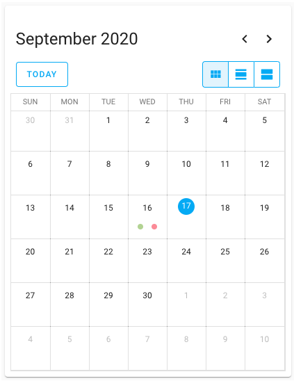

# Homekit Infused 4.x.x

## Content
- [Introduction](../index.md)
- [Installation](../installation.md)
- [Configuration](../configuration.md)
- [Addons](../addons.md)
- [Custom Views](../custom_views.md)
- [Updates](../updates.md)
- [Issues & Questions](../issues.md)
- [About Me](../about.md)
- [Thanks](../thanks.md)

## Addons > Calendar



This addon gives your view a core calendar card.

To add this addon to your view add `calendar:` in your view_config.

To add calendar to your view add the following line:

```yaml
# Example
  my_view:
    calendar:
```

You can use any of the following options to modify your addon.

| Name | Required | Default | Description |
|----------------------------------|-------------|----------------------|-----------------------------------------------------------------------------------------------------------------------------------------------------------------------------------|
| title | no | undefined | Set the title of the stack, ommitting this line will remove the title entirely |
| show_title | no | true | Show or hide the stack title |
| initial_view | no | dayGridMonth | Choose between `dayGridMonth`, `dayGridDay`, and `listWeek` |
| entities | yes | list of entities | Set your calendar entity/entities here, you can define more than one entity per stack  |

```yaml
# Example
  my_view:
    calendar:
      - title: Birthdays
        initial_view: dayGridMonth
        entities: 
          - calendar.contacts
```   
```yaml
# Example
  my_view:
    calendar:
      - title: Birthdays
        initial_view: dayGridMonth
        entities: 
          - calendar.contacts
      - title: Reminders
        initial_view: dayGridMonth
        entities: 
          - calendar.reminders
```               