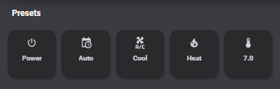

# Homekit Infused 4.x.x

## Content
- [Introduction](../index.md)
- [Installation](../installation.md)
- [Configuration](../configuration.md)
- [Addons](../addons.md)
- [Custom Views](../custom_views.md)
- [Updates](../updates.md)
- [Issues & Questions](../issues.md)
- [About Me](../about.md)
- [Thanks](../thanks.md)

## Addons > Climate


This addon gives your view a climate preset control panel with 5 buttons to control all of your thermostats at once.
To add this addon to your view add `climate:` in your view_config.

To add climate to your view add the following line:

```yaml
# Example
  my_view:
    climate:
```

You can use any of the following options to modify your addon.

| Name | Required | Default | Description |
|----------------------------------|-------------|----------------------|-----------------------------------------------------------------------------------------------------------------------------------------------------------------------------------|
| controls | no | undefined | Define this is you want some global climate controls, see extra options below |
| thermostats | yes | undefined | Define your climate entities with this option, see configuration below |

```yaml
# Example
  my_view:
    climate:
      controls:
```

#### Controls Options

| Name | Required | Default | Description |
|----------------------------------|-------------|----------------------|-----------------------------------------------------------------------------------------------------------------------------------------------------------------------------------|
| title | no | undefined | Set the title of the stack, ommitting this line will remove the title entirely |
| aspect_ratio | no | 1/1 | Set a custom aspect_ratio, this is useful when hiding certain buttons |
| name_power | no | Power | Change the name of the power button |
| icon_power | no | mdi:power | Change the icon of the power button |
| name_auto | no | Auto | Change the name of the auto button |
| icon_auto | no | mdi:calendar-clock | Change the icon of the auto button |
| name_cool | no | Cool | Change the name of the cool button |
| icon_cool | no | mdi:air-conditioner | Change the icon of the cool button |
| name_heat | no | Heat | Change the name of the heat button |
| icon_heat | no | mdi:fire | Change the icon of the heat button |
| icon_set_temperature | no | mdi:thermometer | Change the icon of the set_temperature button |
| show_title | no | true | Show or hide the stack title |
| show_power | no | true | Show or hide the power button |
| show_auto | no | true | Show or hide the auto button |
| show_cool | no | true | Show or hide the cool button |
| show_heat | no | true | Show or hide the heat button |
| show_set_temperature | no | true | Show or hide the set_temperature button |

```yaml
# Example
  my_view:
    climate: 
      controls:
        title: Controls
        name_power: On/Off
        icon_power: mdi:thermostat
```

#### Thermostats Options

| Name | Required | Default | Description |
|----------------------------------|-------------|----------------------|-----------------------------------------------------------------------------------------------------------------------------------------------------------------------------------|
| title | no | undefined | Set the title of the stack, ommitting this line will remove the title entirely |
| columns | no | 3 | Sets the number of columns for this stack |
| lock | no | undefined | Puts a lock on the entire stack |
| entities | yes | list of entities | List your thermostat entities |

```yaml
# Example
  my_view:
    climate: 
      thermostats:
        - title: Ground Floor Thermostats
          entities:
            - climate.thermostat_livingroom
            - climate.thermostat_kitchen
            - climate.thermostat_office
            - climate.thermostat_guest_room
        - title: First Floor Thermostats
          entities:
            - climate.thermostat_bedroom
            - climate.thermostat_bathroom
            - climate.thermostat_hallway
            - climate.thermostat_guest_bedroom
```

```yaml
# Example with controls enabled
  my_view:
    climate:
      controls:
        title: Preset Buttons
      thermostats:
        - title: Thermostats
          entities:
            - climate.thermostat_livingroom
            - climate.thermostat_kitchen
            - climate.thermostat_office
            - climate.thermostat_guest_room
```
```yaml
# Example with extra options
  my_view:
    climate:
      controls:
        title: Preset Buttons
        show_cool: false
      thermostats:
        - title: Thermostats
          columns: 2
          lock: true
          entities:
            - climate.thermostat_livingroom
            - climate.thermostat_kitchen
            - climate.thermostat_office
            - climate.thermostat_guest_room
```

#### Thermostats Extra Options

You can pass any of the following keys to your entities.

| Name | Required | Default | Description |
|----------------------------------|-------------|----------------------|-----------------------------------------------------------------------------------------------------------------------------------------------------------------------------------|
| entity | yes | undefined | Sets the entity used |
| lock | no | undefined | Puts a lock on the button |
| ambient_temperature | no | undefined | Set this to show the current temperature from a different sensor in your thermostat buttons, this is only an aesthetic change and doesn't change the functionality of your thermostat! |

```yaml
# Example with extra keys
  my_view:
    climate:
      controls:
        title: Preset Buttons
      thermostats:
        - title: Thermostats
          entities:
            - entity: climate.thermostat_livingroom
              lock: true
            - entity: climate.thermostat_kitchen
              ambient_temperature: sensor.kitchen_temperature
```

More images:


