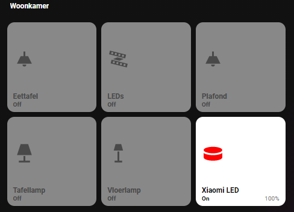

# Homekit Infused 4.x.x

## Content
- [Introduction](../index.md)
- [Installation](../installation.md)
- [Configuration](../configuration.md)
- [Addons](../addons.md)
- [Custom Views](../custom_views.md)
- [Updates](../updates.md)
- [Issues & Questions](../issues.md)
- [About Me](../about.md)
- [Thanks](../thanks.md)

## Addons > Devices



This addon lets you auto-fill your views with buttons

To add devices to your view add the following line:

```yaml
# Example
  kitchen:
    devices:
```

To add your devices give your stack a category title (this can be anything) and list your entities within that config

```yaml
# Example 
  kitchen:
    devices:
      switches:
        - switch.afzuigkap
        - switch.oven
        - switch.airfryer
        - switch.nespresso_apparaat
        - switch.cappumaker
        - switch.waterkoker
        - switch.vaatwasser
        - switch.koelkast_2
      lights:
        - light.keuken
        - light.keuken_leds
        - light.keuken_leds_onder
```  
The example above will create a view for you named Kitchen and automatically does the following:
- sets the title of the view (in this case Kitchen)
- sets the path of the view for your browser to use (in this case https://hassio.local/homekit-infused/kitchen)
- sets an icon for the navigation_bar, subtitle and menu/favorites button
- creates an entry in the rooms section of the menu/frontpage (because of `type: room`)
- shows a badge in the shortcut button with the state of the entity entered
- fills the view with 2 stacks, one named switches and one named lights
- adds the entered entities to those two stacks and try to figure out what kind of entity it is and create a button for them and assign the correct popup.

*Note: under devices you can name the 'category' ANYTHING you want as long as it is again lowercase and has no spaces but underscores.

```yaml
# Example 
  bedroom:
    subtitle: My Bedroom
    devices:
      my_crazy_lights:
        - light.lamp
        - light.wand
      my_other_wicked_lights:
        - lights.ceiling
```

### Extra Options
You can pass some extra data to the entities so that HKI knows what kind of popup and/or color it should give to the buttons or even add a lock to a button. To set some extra keys add a dot at the end of the entity and then the extra key.
E.g. `light.living_room.rgb` or `switch.kitchen_hood.fan`. You can have multiple tags. E.g. `switch.kitchen_hood.fan.lock`, the order of the keys do not matter, `switch.kitchen_hood.lock.fan` will also work!

*Notes: 
- You can use .lock in conjunction with another tag e.g. `switch.lamp.lock.rgb`. Do not try to combine e.g. `rgb` with `color-temp`.
- You can ONLY use .lock on entities that switch something on or off
 
*Tip: You can also set an entire category to be forced with these properties, see examples below.

| Tag | Description |
|----------------------------------|----------------------------------------------------------------------------------------------------------------------------------------------------------------------------------------------|
| lock | this locks an entity and will now need two taps to turn on/off, the first tap unlocks, the second toggles |
| hide | this hides a category title from the stack |
| rgb | Use this tag to specify the entity type as an rgb-light, this lets HKI know that your light needs a different popup than other lights |
| color-temp | Use this tag to specify the entity type as a color-temperature-light, this lets HKI know that your light needs a different popup than other lights |
| fan | Fans are automatically assigned a different looking button (e.g. blue color when turned on and a spinning icon), if your entity isn't in the fan domain (e.g. switch.kitchen_ventilo) you can add the `fan` tag to force it |
| graph | Force an entity to show a graph instead, to color the line_color add a color like this `sensor.my_power_usage.graph.red`, choose between the following colors: `red`, `green`, `blue`, `cyan`, `orange`, `black`, `white`, `purple`, `pink`, `yellow` |

Examples:

```yaml
lights:
  devices:
    living_room:
      - light.ceiling
      - light.wall.rgb # This entity is forced as an RGB entity
      - light.table_lamp.lock # This entity has a lock
  
    bedroom.lock: # This entire room/categorie has a lock
      - light.ceiling.color-temp # This entity is forced as a COLOR TEMP entity 
      - light.wall
      - light.table_lamp
```
```yaml
kitchen:
  devices:
    lights:
      - light.ceiling.color-temp # This entity is forced as a COLOR TEMP entity
      - light.wall
      - light.table_lamp.lock # This entity has a lock
    switches.hide: # This title is hidden in the view 
      - switch.kitchen_hood.fan # This entity is forced as a fan entity
      - switch.freezer
      - switch.refrigerator.lock # This entity has a lock
    fans.fan: # This entire room is forced as a fan entity
      - switch.kitchen_hood
      - switch.airco_exhaust
      - switch.toilet_exhaust
```

More images:


