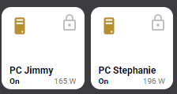

# Homekit Infused 4.x.x

## Content
- [Introduction](../index.md)
- [Installation](../installation.md)
- [Configuration](../configuration.md)
- [Addons](../addons.md)
- [Custom Views](../custom_views.md)
- [Updates](../updates.md)
- [Issues & Questions](../issues.md)
- [About Me](../about.md)
- [Thanks](../thanks.md)

## Addons > Devices


This addon lets you auto-fill your views with buttons

To add devices to your view add the following line:

```yaml
# Example
  my_view:
    devices:
```

You can use any of the following options to modify your addon.

| Name | Required | Default | Description |
|----------------------------------|-------------|----------------------|-----------------------------------------------------------------------------------------------------------------------------------------------------------------------------------|
| title | no | undefined | Set the title of the stack, ommitting this line will remove the title entirely |
| columns | no | 3 | Define the number of columns this stack will use |
| square | no | true | Set if the buttons should be square or not, this is only useful when you set individual aspect_ratios in the config below |
| lock | no | false | this locks the entire stack and will now need two taps to turn on/off, the first tap unlocks, the second toggles |
| entities | yes | list of entities | List all your entities you want to show up here |

### Devices Extra Options
The recommended method to change icons and/or friendly names is by the use of customize.yaml, however this is not always adequate enough for the customizations that we might want, you can pass any of the options below to your entity to customize the look and feel.

By default you must enter an array of entities like in the examples below, this does not need extra options and will just get the global name/icon.
You must define it as an object instead to make use of the options below. See examples.

| Name | Required | Default | Description |
|----------------------------------|-------------|----------------------|-----------------------------------------------------------------------------------------------------------------------------------------------------------------------------------|
| entity | yes | undefined | Set the entity used |
| type | no | auto | This forces a button to be seen by HKI as a specific type, which alters the appearance. Choose between `rgb`, `color-temp`, `switch`, `sensor` or `fan`. By default HKI tries to figure out itself what kind of type the button is, but if it gets it wrong force it by setting the type |
| name | no | global_name | Set a name for this button, this accepts button-card JS templates |
| label | no | none | Set a label for this button, this accepts button-card JS templates |
| icon | no | global_icon | Set an icon for this button, this accepts button-card JS templates |
| entity_picture | no | global_entity_picture | Set an entity picture for this button, note that when an entity_picture is set in either customize.yaml or here, that it will take priority over an icon |
| lock | no | false | this locks this button and will now need two taps to turn on/off, the first tap unlocks, the second toggles |
| aspect_ratio | no | 1/1 | Set a custom aspect_ratio for this button, note that you will want to set `square: false` in the stacks configuration when setting anything other than 1/1 |
| size | no | 25% | Set the icon size, note that this setting is not always working as expected due to the grid used, play around with it |
| show_name | no | true | Choose to show/hide the name, set to `false` to hide it |
| show_label | no | true | Choose to show/hide the label, set to `false` to hide it |
| show_icon | no | true | Choose to show/hide the icon, set to `false` to hide it |
| show_state | no | true | Choose to show/hide the state, set to `false` to hide it |
| show_last_changed | no | false | Choose to show/hide the last_changed state, set to `true` to show it, note that this will replace the label! |
| opacity | no | 0.5 | Set this to change the opacity when a button is `off`, this is by default 0.5, this will ONLY change the opacity for when a state is `off`! |
| spin | no | false | Set this to `true` if you want the icon to spin when the state is `on` |

Examples:

```yaml
# Example Basic
living_room:
  devices:
    - title: Living Room
      columns: 4
      entities:
        - switch.receiver
        - switch.samsung_tv
        - switch.xbox_one
```
```yaml
# Example Multiple Stacks
living_room:
  devices:
    - title: Living Room
      square: false
      entities:
        - switch.receiver
        - switch.samsung_tv
        - switch.xbox_one
    - title: Bedroom
      columns: 3
      entities:
        - switch.receiver
        - switch.samsung_tv
        - switch.xbox_one
```
```yaml
# Example Custom
living_room:
  devices:
    - title: Woonkamer
      entities:
        - entity: switch.receiver
          icon: mdi:speakers
          label: My Speaker
        - entity: switch.samsung_tv
          name: TV
        - entity: switch.xbox_one
          lock: true
```
```yaml
# Example Mixed Basic with Custom
living_room:
  devices:
    - title: Living Room
      entities:
        - switch.receiver
        - entity: switch.samsung_tv
          name: TV
        - entity: switch.xbox_one
          lock: true
        - light.lamp
        - light.ceiling
        - entity: light.tv_lamp
          name: TV
          icon: mdi:lamp
```

#### Tips
By default the label is either the brightness of a light or empty, however with button-card JS templates you can have a cool label like this



```yaml
# Example Custom Label
my_view:
  devices:
    - title: Laundry Room
      entities:
        - entity: switch.washing_machine
          lock: true
          label: "[[[ return `${states['sensor.washing_machine_power'].state} W`; ]]]"
```

The same is true for icons and you can template an icon to be different for each state:

```yaml
# Example Custom Icon
my_view:
  devices:
    - title: Laundry Room
      entities:
        - entity: switch.washing_machine
          icon: "[[[ if (entity.state == 'on') return `mdi:lamp`; else return `mdi:floor-lamp` ]]]"
```

More images:


