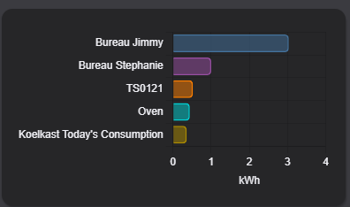
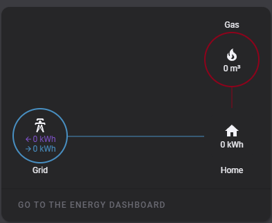
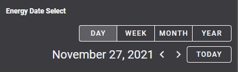

# Homekit Infused 2021.x.x

## Content
- [Introduction](../index.md)
- [Installation](../installation.md)
- [Configuration](../configuration.md)
- [Addons](../addons.md)
- [Custom Views](../custom_views.md)
- [Updates](../updates.md)
- [Issues & Questions](../issues.md)
- [About Me](../about.md)
- [Thanks](../thanks.md)

## Addons > Energy Cards



This addon gives your view a wide range of different core energy cards.

To add this addon to your view add `energy:` in your view_config.

To add any of the energy cards to your view add the following line:

```yaml
# Example
  my_view:
    energy:
```

*NOTE: For more screenshots of what the options below look like, you can refer to the [official HA documentation](https://www.home-assistant.io/lovelace/energy/). This addon has quite a few different cards check them all out.

You can use any of the following options to modify your addon.

| Name | Required | Default | Description |
|----------------------------------|-------------|----------------------|-----------------------------------------------------------------------------------------------------------------------------------------------------------------------------------|
| title | no | undefined | Set the title of the stack, ommitting this line will remove the title entirely |
| energy-date-selection | no | undefined | Add this line to your config if you want to use this card with your addon |
| energy-usage-graph | no | undefined | Add this line to your config if you want to use this card with your addon |
| energy-solar-graph | no | undefined | Add this line to your config if you want to use this card with your addon |
| energy-gas-graph | no | undefined | Add this line to your config if you want to use this card with your addon |
| energy-sources-table | no | undefined | Add this line to your config if you want to use this card with your addon |
| energy-grid-neutrality-gauge | no | undefined | Add this line to your config if you want to use this card with your addon |
| energy-solar-consumed-gauge | no | undefined | Add this line to your config if you want to use this card with your addon |
| energy-carbon-consumed-gauge | no | undefined | Add this line to your config if you want to use this card with your addon |
| energy-devices-graph | no | undefined | Add this line to your config if you want to use this card with your addon |
| energy-distribution | no | undefined | Add this line to your config if you want to use this card with your addon |
| link_dashboard | no | false | Add this to your card to create a shortcut to your energy dashboard (this only works when using the `energy-distribution` type)

```yaml
# Example
  my_view:
    energy:
      - title: Energy Date Select
        type: energy-date-selection
      - title: Energy Usage
        type: energy-usage-graph
``` 
```yaml
# Example of all types included with a title
  my_view:
    energy:
      - title: Energy Date Select
        type: energy-date-selection
      - title: Energy Usage
        type: energy-usage-graph
      - title: Energy Solar
        type: energy-solar-graph
      - title: Energy Gas
        type: energy-gas-graph
      - title: Energy Distribution with link
        type: energy-distribution
        link_dashboard: true
      - title: Energy Distribution without link
        type: energy-distribution
      - title: Energy Sources
        type: energy-sources-table
      - title: Grid Neutrality
        type: energy-grid-neutrality-gauge
      - title: Solar Consumed
        type: energy-solar-consumed-gauge
      - title: Carbon Consumed
        type: energy-carbon-consumed-gauge
      - title: Energy Devices
        type: energy-devices-graph
```
```yaml
# Example of all types included without a title
  my_view:
    energy:
      - type: energy-date-selection
      - type: energy-usage-graph
      - type: energy-solar-graph
      - type: energy-gas-graph
      - type: energy-distribution
        link_dashboard: true
      - type: energy-distribution
      - type: energy-sources-table
      - type: energy-grid-neutrality-gauge
      - type: energy-solar-consumed-gauge
      - type: energy-carbon-consumed-gauge
      - type: energy-devices-graph
```



