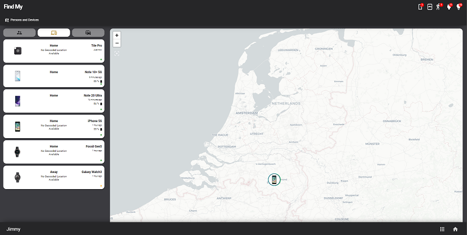

# Homekit Infused 2021.x.x

## Content
- [Introduction](../index.md)
- [Installation](../installation.md)
- [Configuration](../configuration.md)
- [Addons](../addons.md)
- [Custom Views](../custom_views.md)
- [Updates](../updates.md)
- [Issues & Questions](../issues.md)
- [About Me](../about.md)
- [Thanks](../thanks.md)

## Addons > Find My



This addon is a complete and beautiful Find My addon inspired by Apple's own Find My application (and a little bit from @LRvdLinden)

To add find_my to your view add the following line:

```yaml
# Example
  my_view:
    find_my:
```

You can use any of the following options to modify your addon. Choose at least one of the categories for this to function properly!

| Name | Required | Default | Description |
|----------------------------------|-------------|----------------------|-----------------------------------------------------------------------------------------------------------------------------------------------------------------------------------|
| persons | no | undefined | Set the persons you want to show in find_my |
| devices | no | undefined | Set the devices you want to show in find_my |
| vehicles | no | undefined | Set the vehicles you want to show in find_my |

#### Find My Extra Options
You can pass any of the options below to your entity to customize the look and feel. If you don't set icon or picture_entity it will try to get them from customize.yaml.

| Name | Required | Default | Description |
|----------------------------------|-------------|----------------------|-----------------------------------------------------------------------------------------------------------------------------------------------------------------------------------|
| name | no | global_name | Set a name for this entity |
| entity | yes | undefined | Set the entity used, these work best with either `person` or `device_tracker` entities |
| icon | no | global_icon | Specify a custom icon for your entity |
| entity_picture | no | global_entity_picture | Specify a custom entity_picture for your entity |
| battery_entity | no | undefined | If this entity has a separate battery entity you can enter it here, else no battery is shown |
| geocoded_location_entity | no | undefined | If this entity has a separate geocoded location entity you can enter it here, else not geocoded location is shown |

Examples:

```yaml
# Example persons
  my_view:
    find_my:
      persons:
        - name: Jimmy
          entity: person.jimmy
          battery_entity: sensor.sm_n976b_battery_level
          geocoded_location_entity: sensor.sm_n976b_geocoded_location
        - name: Stephanie
          entity: person.stephanie
          battery_entity: sensor.sm_n986b_batterijniveau
          geocoded_location_entity: sensor.sm_n986b_gegeocodeerde_locatie
```
```yaml
# Example persons and devices
  my_view:
    find_my:
      persons:
        - name: Jimmy
          entity: person.jimmy
          battery_entity: sensor.sm_n976b_battery_level
          geocoded_location_entity: sensor.sm_n976b_geocoded_location
        - name: Stephanie
          entity: person.stephanie
          battery_entity: sensor.sm_n986b_batterijniveau
          geocoded_location_entity: sensor.sm_n986b_gegeocodeerde_locatie
      devices:
        - name: Tile Pro
          entity: device_tracker.dog
        - name: Note 10+ 5G
          entity: device_tracker.sm_n976b
          geocoded_location_entity: sensor.sm_n976b_geocoded_location
          battery_entity: sensor.sm_n976b_battery_level
```


#### Entity Picture Tips
You can use entity pictures so that your view will look like the ones from the screenshots. It is recommended that you create the entity pictures yourself and not just enter pictures you find on the internet.

The best settings will be to open paint/photoshop. Create a square of 130x130 pixels and put your entity picture in the middle of it (resize the photo at will).

This specific addon has a white background so you don't need to make the background transparant, but if you would like to use these images elsewhere I will recommend you to remove transparency by either using an online tool or Adobe Photoshop.

#### Bonus Entity Picture Tips
- If you have iCloud you can get beautiful ready to go images from the icloud website by logging in view icloud and then saving the images to your desktop.
- If you use the Unifi Controller you can get some nice images as well by clicking any device and then click on report wrong icon (this will open up a search menu in which you can right-click to save, note that Apple users will want to try Chrome or Firefox since Safari doesn't support this).
