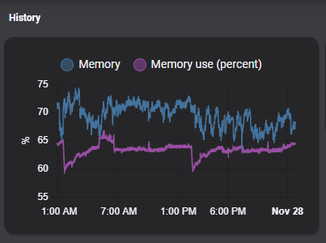
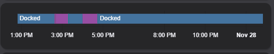

# Homekit Infused 2021.x.x

## Content
- [Introduction](../index.md)
- [Installation](../installation.md)
- [Configuration](../configuration.md)
- [Addons](../addons.md)
- [Splitting the Configuration](../splitting-the-config.md)
- [Updates](../updates.md)
- [Issues & Questions](../issues.md)
- [About Me](../about.md)
- [Thanks](../thanks.md)

## Addons > History Card



This addon gives your view a core history card that shows the history of a given entity (or multiple entities), this can be useful for example when you want to track how many times you have opened a specific door.
To add this addon to your view add `history:` in your view_config.

To add history card to your view add the following line:

```yaml
# Example
  my_view:
    history:
```

You can use any of the following options to modify your addon.

| Name | Required | Default | Description |
|----------------------------------|-------------|----------------------|-----------------------------------------------------------------------------------------------------------------------------------------------------------------------------------|
| title | no | undefined | Set the title of the stack, ommitting this line will remove the title entirely |
| entities | yes | list of entities | Set your entity/entities here, you can define more than one entity per card |
| hours_to_show | no | 24 | Set how many hours you want the history card to show |
| refresh_interval | no | 0 | Set the refresh interval rate in `s` |

```yaml
# Example
  my_view:
    history:
      - title: History
        hours_to_show: 48
        refresh_interval: 60
        entities:
          - sensor.unifi_gateway_mem
          - sensor.memory_use_percent
``` 

