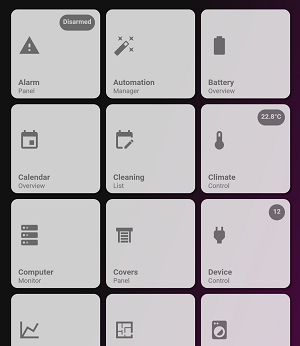

# Homekit Infused 2021.x.x

## Content
- [Introduction](../index.md)
- [Installation](../installation.md)
- [Configuration](../configuration.md)
- [Addons](../addons.md)
- [Custom Views](../custom_views.md)
- [Updates](../updates.md)
- [Issues & Questions](../issues.md)
- [About Me](../about.md)
- [Thanks](../thanks.md)

## Addons > Menu



This addon gives your view a button stack with shortcuts to all your views.
To add this addon to your view add `menu:` in your view_config.

To add the menu to your view add the following line:

```yaml
# Example
  my_view:
    menu:
```

*Note: this addon will show shortcuts to all defined views with the exception of views that have `type: room` in their config. You can force the view to be shown in the menu by adding `show_in_menu: true` to the view_config. However when `type: room` you should probably use the `rooms:` addon instead! This addon is useful for the menu view.
*Note: The same is true for views that have a view_selector in them, please refer to the view selector documentation on how to use this with view_selector enabled.

```yaml
# Example
  my_room_view:
    type: room
    show_in_menu: true
```

You can use any of the following options to modify your addon.

| Name | Required | Default | Description |
|----------------------------------|-------------|----------------------|-----------------------------------------------------------------------------------------------------------------------------------------------------------------------------------|
| title | no | Favorites | Set the title of the stack |
| show_title | no | true | Show or hide the stack title |

```yaml
# Example
  my_view:
    menu:
      show_title: false
```
