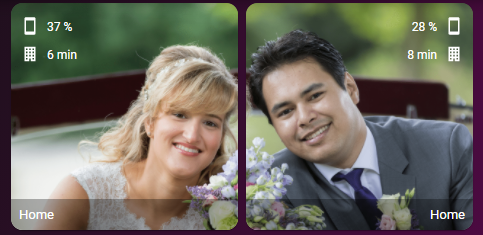

# Homekit Infused 4.x.x

## Content
- [Introduction](../index.md)
- [Installation](../installation.md)
- [Configuration](../configuration.md)
- [Addons](../addons.md)
- [Custom Views](../custom_views.md)
- [Updates](../updates.md)
- [Issues & Questions](../issues.md)
- [About Me](../about.md)
- [Thanks](../thanks.md)

## Addons > Persons



This addon gives your view photo's with information of your family members.

To add this addon to your view add `persons:` in your view_config.
To add persons to your view add the following line:

```yaml
# Example
  my_view:
    persons:
```

You can use any of the following options to modify your addon.

| Name | Required | Default | Description |
|----------------------------------|-------------|----------------------|-----------------------------------------------------------------------------------------------------------------------------------------------------------------------------------|
| entity | yes | person.john | Set your person entity here, this is required! |
| alignment | no | left | 
| text_color | no | black |  
| image_path | yes | /local/images/YOUR_IMAGE.png | Set the location of your persons photo/image, put this in your `/www/images` folder |
| phone_battery_sensor | no | undefined | Set your persons phone battery level entity here |
| travel_time_to_home | no | undefined | Set your persons travel time to home entity here (you must setup travel sensors for this to work) |
| travel_time_to_work | no | undefined | Set your persons travel time to work entity here (you must setup travel sensors for this to work) |
| path | no | object_name | Set a different path for when you press the button, by default it will use the object name of the person (e.g. `john:`, this results in a path of `/hki-user/views/john`) |


```yaml
# Example
    persons:
      stephanie:
        entity: person.stephanie
        text_color: white
        image_path: /local/images/stephanie_small.png
        phone_battery_sensor: sensor.sm_n986b_batterijniveau
        travel_time_to_home: sensor.reistijd_stephanie
        travel_time_to_work: sensor.reistijd_stephanie_work
        path: stephanie_location
```

But wait there is more! If you have an uneven numbered household you will notice that it doesn't look all that great.
There is an alternative addon which has it's own config and will help you create better looking views when using 3/5/7 etc households.
Place the last person in your house in the `persons_alt:` addon instead and you can configure that entire stack with the same options.

To add this addon to your view add `persons_alt:` in your view_config.
To add persons_alt to your view add the following line:

```yaml
# Example
  my_view:
    persons_alt:
```
```yaml
# Example 3 persons
  my_view:
    persons:
      stephanie:
        entity: person.stephanie
        text_color: white
        image_path: /local/images/stephanie_small.png
        phone_battery_sensor: sensor.sm_n986b_batterijniveau
        travel_time_to_home: sensor.reistijd_stephanie
        travel_time_to_work: sensor.reistijd_stephanie_work
        path: stephanie_location
      jimmy:
        entity: person.jimmy
        alignment: right
        text_color: white
        image_path: /local/images/jimmy_small.png
        phone_battery_sensor: sensor.sm_n976b_battery_level
        travel_time_to_home: sensor.reistijd_jimmy
        travel_time_to_work: sensor.reistijd_jimmy_work
        path: jimmy_location
    persons_alt:
      tala:
        name: Tala
        entity: person.tala
        text_color: white
        image_path: /local/images/tala2.png
```                