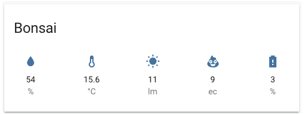

# Homekit Infused 2021.x.x

## Content
- [Introduction](../index.md)
- [Installation](../installation.md)
- [Configuration](../configuration.md)
- [Addons](../addons.md)
- [Custom Views](../custom_views.md)
- [Updates](../updates.md)
- [Issues & Questions](../issues.md)
- [About Me](../about.md)
- [Thanks](../thanks.md)

## Addons > Plant Status Card



This addon gives your view a core plant status card that shows the different entities associated with your plant.
To add this addon to your view add `plant_status:` in your view_config.

To add plant_status card to your view add the following line:

```yaml
# Example
  my_view:
    plant_status:
```

*NOTE: This addon is untested since I do not have plant sensors!

You can use any of the following options to modify your addon.

| Name | Required | Default | Description |
|----------------------------------|-------------|----------------------|-----------------------------------------------------------------------------------------------------------------------------------------------------------------------------------|
| title | no | undefined | Set the title of the stack, ommitting this line will remove the title entirely |
| entity | yes | undefined | Set your entity here, you can only define one entity per card |

```yaml
# Example
  my_view:
    plant_status:
      - title: Bonsai
        entity: plant.bonsai
``` 