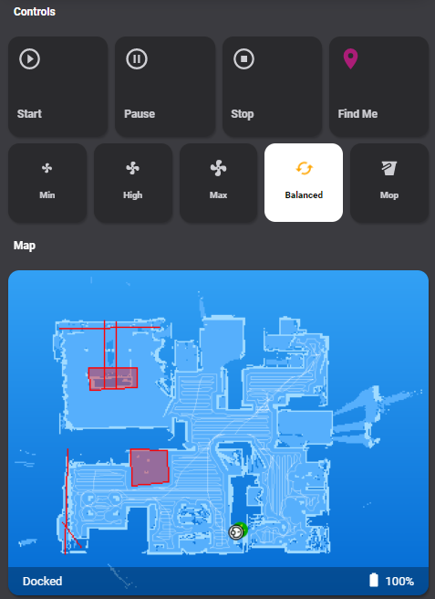

# Homekit Infused 4.x.x

## Content
- [Introduction](../index.md)
- [Installation](../installation.md)
- [Configuration](../configuration.md)
- [Addons](../addons.md)
- [Custom Views](../custom_views.md)
- [Updates](../updates.md)
- [Issues & Questions](../issues.md)
- [About Me](../about.md)
- [Thanks](../thanks.md)

## Addons > Vacuum


This addon gives your view a vacuum control card.
To use this addon you must prepare with the following steps.

Create a sensor in your `configuration.yaml` file (replace YOUR_VACUUM_ENTITY with your own entity, include the `vacuum.` part of the entity)
```
sensor:
  - platform: template
    sensors:
      vacuum_fan_speed:
        value_template: >-
          {{ states.YOUR_VACUUM_ENTITY.attributes.fan_speed }}
```
Next, look at your vacuum entities attributes and look at the fan_speed_list. Now open `/hki-user/config/general_config.yaml` and adjust the fan speed names to the ones in your fan speed list. This will probably not need to be changed if you use the miio integration in HA.
Do NOT change the names on the left side! Only change the names on the right side of the `:`.

```yaml
# in /hki-user/config/general_config.yaml
  vacuum:
    min: Silent
    medium: Standard
    high: Medium
    max: Turbo
    mop: Gentle
```
Now continue on to setup the addon!

To add this addon to your view add `vacuum:` in your view_config.

To add vacuum to your view add the following line:

```yaml
# Example
  my_view:
    vacuum:
```

You can use any of the following options to modify your addon.
| Name | Required | Default | Description |
|----------------------------------|-------------|----------------------|-----------------------------------------------------------------------------------------------------------------------------------------------------------------------------------|
| title | no | Controls | Set the title of the stack |
| show_title | no | true | Show or hide the stack title |
| entity | yes | vacuum.roborock_vacuum_s5 | Enter your vacuum entity here |
| sensor | yes | sensor.vacuum_fan_speed | Enter the sensor entity we created in the first step here |
| show_mop | no | true | Show or hide the mop feature |

```yaml
# Example
  my_view:
    vacuum:
      entity: vacuum.roborock_vacuum_s5
      sensor: sensor.vacuum_fan_speed
```

At this moment there is no interactive map possible, this will be added in the future, however if your vacuum gives a camera entity (like Valetudo and Valetudo RE can) than you can use that as your live map. Note that you must have flashed your vacuum with either Valetudo or Valetudo RE AND setup their respective docker containers (I can't believe it's Valetudo or Valetudo-Mapper depending on which one you have flashed)

You can have it look like the image below when using the following config:
```yaml
  vacuum:
    vacuum:
      entity: vacuum.roborock_vacuum_s5
      sensor: sensor.vacuum_fan_speed
    devices:
      map: 
        - camera.rockrobo_map
```
