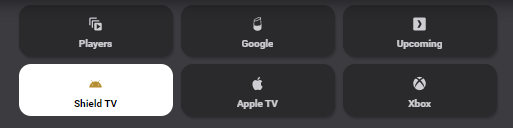
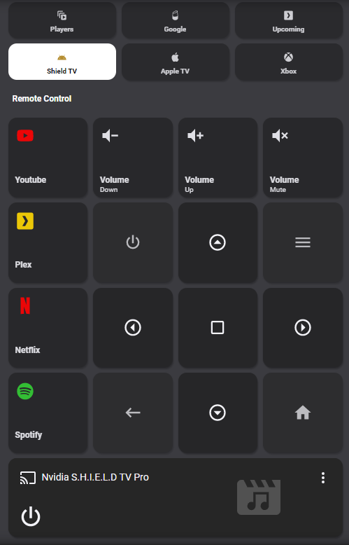

# Homekit Infused 4.x.x

## Content
- [Introduction](index.md)
- [Installation](installation.md)
- [Configuration](configuration.md)
- [Addons](../addons.md)
- [Custom Views](custom_views.md)
- [Updates](updates.md)
- [Issues & Questions](issues.md)
- [About Me](about.md)
- [Thanks](thanks.md)

## Addons > View Selector



This addon gives your view a selector menu at the top of your view.
To add this addon to your view add `view_selector:` in your view_config.

To add view_selector to your view add the following line:

```yaml
# Example
  my_view:
    view_selector:
```

The view selector works by leveraging multiple views as pages. You must add the view_selector to every view that you want the view_selector to show on.
Also note that when adding view_selector to your view it will be removed from the main menu! You can re-add them to your view by adding `show_in_menu: true`.

The view selector needs to have a name and icon for each button you want to create and this needs to be put on all views!
The object name of the items you define in view_selector MUST correspond to the view object name you want to create a shortcut to.

You can use `.this_view` to tell the view_selector that the button should light up when on this view.

```yaml
# Example with 2 views with a view_selector
  media_players:
    view_selector:
      media_players:
        name: Players
        icon: mdi:animation-play
      google_home:
        name: Google
        icon: mdi:google-home

  google_home:
    view_selector:
      media_players:
        name: Players
        icon: mdi:animation-play
      google_home:
        name: Google
        icon: mdi:google-home
```
```yaml
# Example with 2 views with a view_selector with one view shown in the main menu
  media_players:
    show_in_menu: true
    view_selector:
      media_players:
        name: Players
        icon: mdi:animation-play
      google_home:
        name: Google
        icon: mdi:google-home

  google_home:
    view_selector:
      media_players:
        name: Players
        icon: mdi:animation-play
      google_home:
        name: Google
        icon: mdi:google-home
```
```yaml
# Example with 2 views with a view_selector with one view shown in the main menu and with .this_view
  media_players:
    show_in_menu: true
    view_selector:
      media_players.this_view:
        name: Players
        icon: mdi:animation-play
      google_home:
        name: Google
        icon: mdi:google-home

  google_home:
    view_selector:
      media_players:
        name: Players
        icon: mdi:animation-play
      google_home.this_view:
        name: Google
        icon: mdi:google-home
```

More images:
