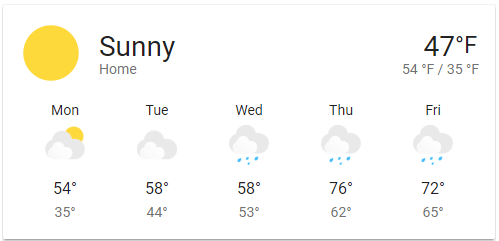
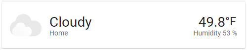

# Homekit Infused 2021.x.x

## Content
- [Introduction](../index.md)
- [Installation](../installation.md)
- [Configuration](../configuration.md)
- [Addons](../addons.md)
- [Custom Views](../custom_views.md)
- [Updates](../updates.md)
- [Issues & Questions](../issues.md)
- [About Me](../about.md)
- [Thanks](../thanks.md)

## Addons > Weather



This addon gives your view a weather forecast card.
To add this addon to your view add `weather:` in your view_config.

To add weather to your view add the following line:

```yaml
# Example
  my_view:
    weather:
```

You can use any of the following options to modify your addon.

| Name | Required | Default | Description |
|----------------------------------|-------------|----------------------|-----------------------------------------------------------------------------------------------------------------------------------------------------------------------------------|
| title | no | undefined | Set the title of the stack, ommitting this line will remove the title entirely |
| entity | yes | undefined | Set your weather entity, this must be in the weather domain! |
| city_name | yes | undefined | Set your city name |
| show_forecast | no | true | Change this to `false` if you want a small card instead (which can be used on the frontpage) |
| path | no | weather | Change the path the card takes to you when clicked |

```yaml
# Example
  my_view:
    weather: 
      - title: Weather
        entity: weather.eindhoven
        city_name: Eindhoven
```
```yaml
# Example multiple weather cards
  my_view:
    weather: 
      - title: Eindhoven
        entity: weather.eindhoven
        city_name: Eindhoven
      - title: London
        entity: weather.london
        city_name: Eindhoven
```

More images:

