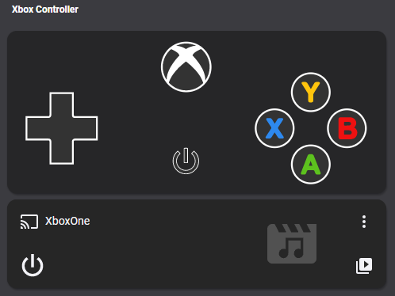

# Homekit Infused 2021.x.x

## Content
- [Introduction](../index.md)
- [Installation](../installation.md)
- [Configuration](../configuration.md)
- [Addons](../addons.md)
- [Custom Views](../custom_views.md)
- [Updates](../updates.md)
- [Issues & Questions](../issues.md)
- [About Me](../about.md)
- [Thanks](../thanks.md)

## Addons > Xbox Controller



This addon gives your view an Xbox Controller card.

To add this addon to your view add `xbox_controller:` in your view_config.
To add xbox_controller to your view add the following line:

```yaml
# Example
  my_view:
    xbox_controller:
```

You can use any of the following options to modify your addon.

| Name | Required | Default | Description |
|----------------------------------|-------------|----------------------|-----------------------------------------------------------------------------------------------------------------------------------------------------------------------------------|
| title | no | undefined | Set the title of the stack, ommitting this line will remove the title entirely |
| xbox_entity | yes | media_player.xboxone | Set your Xbox entity here, this must be in the media_player domain |
| remote_entity | yes | remote.xboxone_remote | Set your Xbox remote entity here, this must be in the remote domain |

```yaml
# Example
  my_view:
    xbox_controller:
      - title: Xbox One
        xbox_entity: media_player.xboxone
        remote_entity: remote.xboxone_remote
```               
```yaml
# Example multiple controllers
  my_view:
    xbox_controller:
      - title: Xbox One
        xbox_entity: media_player.xboxone
        remote_entity: remote.xboxone_remote
      - title: Xbox One X
        xbox_entity: media_player.xboxone_x
        remote_entity: remote.xboxone_x_remote
```   