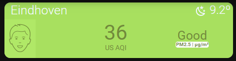

# Homekit Infused

Back to [Addon List](../addon_list.md)

# Air Visual Card


### Description
This is a small and elegant card that shows you air quality.

### Requirements (HACS)

| Name | Type  | Description |
|----------------------------------|-------------|---------------------------------------------------------------------------------------------------------------------------------------------------------------------------------------------------------|
| [Air Visual Card](https://github.com/dnguyen800/air-visual-card) | Frontend | This is a small and elegant air quality card |

### Resources
Add the following line to your lovelace resources 
```
/hacsfiles/air-visual-card/air-visual-card.js
```

### Configuration
- To use this you MUST setup Air Visual, you can do this by adding it as an integration in Home Assistant (sidebar > configuration > integrations > add).
- To get an Air Visual API key you can click [here](https://www.iqair.com/air-pollution-data-api)

### Advanced

| Properties | Required | Default | Description |
|----------------------------------|-------------|----------------------------------|----------------------------------------------------------------------------------------------------------------------------------------------------------------------|
| air_pollution_level | yes | sensor.u_s_air_pollution_level | Sets the air pollution sensor for this card |
| air_quality_index | yes | sensor.u_s_air_quality_index | Sets the air quality index sensor for this card |
| main_pollutant | yes | sensor.u_s_main_pollutant | Sets the main pollutant sensor for this card |
| temp | yes | weather.dark_sky | Sets your current weather entity for this card |
| city | yes | Eindhoven | Sets the city name that you are currently monitoring |

### Install
- Create a new file inside the folder of the view you want (e.g. /homekit-infused/user/views/weather/), you can name the file however you want (e.g. air-visual-card.yaml)
- Copy the code below and make changes if needed

```
- type: custom:air-visual-card
  style: |
    ha-card {
      border-radius: var(--border-radius);
      box-shadow: var(--box-shadow);
      overflow: hidden;
    }
  air_pollution_level: sensor.u_s_air_pollution_level
  air_quality_index: sensor.u_s_air_quality_index
  main_pollutant: sensor.u_s_main_pollutant
  temp: weather.dark_sky
  city: Eindhoven
```

### Layout card and horizontal/vertical stacks
I know the HA documentation has this perfectly explained already, but to make it easier on you I will try to explain in more detail [here](../addons/stacks.md)
