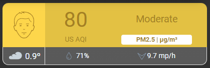

# Homekit Infused 5

## Content
- [Introduction](../index.md)
- [Installation](../installation.md)
- [Configuration](../configuration.md)
- [Addons](../addons.md)
- [Updates](../updates.md)
- [Issues & Questions](../issues.md)
- [About Me](../about.md)
- [Thanks](../thanks.md)

## Addons > Air Visual

A nice air quality card for your views.

### HACS Requirements

| Name | Type  | Description |
|----------------------------------|-------------|---------------------------------------------------------------------------------------------------------------------------------------------------------------------------------------------------------|
| [Air Visual Card](https://github.com/dnguyen800/air-visual-card) | Frontend | A card that shows you air quality |

You must have setup the Air Visual integration in Home Assistant (you can do this in the integrations section of Home Assistant)

You can use any of the following options to modify your addon.

### Stack and Addon config

| Name | Required | Default | Description |
|----------------------------------|-------------|----------------------|-----------------------------------------------------------------------------------------------------------------------------------------------------------------------------------|
| title | no | undefined | Set the title of the stack, ommitting this line will or setting `title: hide` will hide the title |
| [view_layout](layout.md#view-layout) | no | undefined | This is best used in conjunction with the [layout](layout.md#view-layout) addon, but can also be used to control whether to show this stack on different screen sizes. |
| weather | no | unknown | Setup a weather entity to show the weather in this card |
| hide_header | no | true | Whether to show/hide the header title of this card (this is NOT the same as the title defined above) |
| air_pollution_level | yes | sensor.u_s_air_pollution_level | Set the air pollution sensor entity |
| air_quality_index | yes | sensor.u_s_air_quality_index | Set the air quality index sensor entity |
| main_pollutant | yes | sensor.u_s_main_pollutant | Set the main pollutant sensor entity |
| city_name | yes | unknown | Set your city name |
| type | no | undefined | Setting a type can make the stack condtional, this option will ONLY accept `conditional` |
| conditions | no | undefined | Add entities and conditions, this will determine when this addon will be shown, e.g. if entity x is turned `on`, then show this addon (see [addons](../addons.md) for examples |


```yaml
# views.yaml (example)
  my_view:
    addons:
      air_visual:
        - air_pollution_level: sensor.u_s_air_pollution_level
          air_quality_index: sensor.u_s_air_quality_index
          main_pollutant: sensor.u_s_main_pollutant
          weather: weather.eindhoven
          city_name: Eindhoven
```

### Images:


