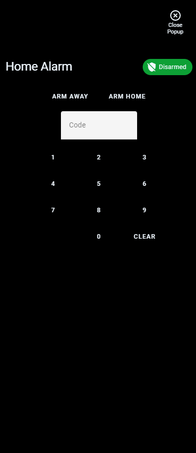

# Homekit Infused 5

## Content
- [Introduction](../index.md)
- [Installation](../installation.md)
- [Configuration](../configuration.md)
- [Addons](../addons.md)
- [Updates](../updates.md)
- [Issues & Questions](../issues.md)
- [About Me](../about.md)
- [Thanks](../thanks.md)

## Alarm

You can setup your alarm in here including the header badge and/or popup. The settings on this page MUST be configured in `/hki-user/config/config.yaml`!

| Name | Required | Default | Description |
|----------------------------------|-------------|----------------------|-----------------------------------------------------------------------------------------------------------------------------------------------------------------------------------|
| entity | yes | alarm_control_panel.home_alarm | Sets the alarm entity used |
| show_badge | no | true | Choose whether to show or hide the alarm badge in the header |
| icon | no | predefined | Set your own alarm icon, this accepts [JS templates](https://github.com/custom-cards/button-card#javascript-templates) |
| icon_color | no | predefined | Set your own icon color, this accepts [JS templates](https://github.com/custom-cards/button-card#javascript-templates) |
| popup | no | keypad | Set what cards to show in the popup when you press the alarm badge, if this line is omitted it will show the default keypad instead |

```yaml
# config.yaml (default settings)
  alarm:
    entity: alarm_control_panel.home_alarm
    show_badge: true
```
```yaml
# config.yaml (example custom cards)
  alarm:
    entity: alarm_control_panel.home_alarm
    show_badge: true
    popup:
      - type: markdown
        content: My Alarm Panel
      - type: alarm-panel
        entity: alarm_control_panel.home_alarm
```

### Images:



