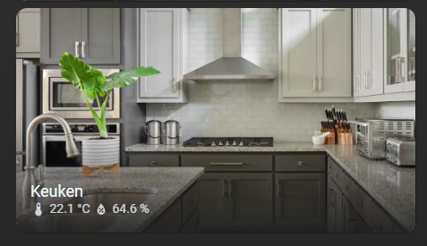

# Homekit Infused 5

## Content
- [Introduction](../index.md)
- [Installation](../installation.md)
- [Configuration](../configuration.md)
- [Addons](../addons.md)
- [Updates](../updates.md)
- [Issues & Questions](../issues.md)
- [About Me](../about.md)
- [Thanks](../thanks.md)

## Addons > Area Card

The Area card lets you control and monitor an individual area.

You can use any of the following options to modify your addon.

### Stack Config

| Name | Required | Default | Description |
|----------------------------------|-------------|----------------------|-----------------------------------------------------------------------------------------------------------------------------------------------------------------------------------|
| title | no | undefined | Set the title of the stack, ommitting this line will or setting `title: hide` will hide the title |
| columns | no | 3 | Define the number of columns this stack will use |
| [view_layout](layout.md#view-layout) | no | undefined | This is best used in conjunction with the [layout](layout.md#view-layout) addon, but can also be used to control whether to show this stack on different screen sizes. |
| conditional | no | false | Setting this to `true` will make the stack condtional |
| conditions | no | undefined | Add entities and conditions, this will determine when this addon will be shown, e.g. if entity x is turned `on`, then show this addon (see [addons](../addons.md) for examples |
| areas | yes | list of area ID's | List all your areas you want to show up here, you MUST use an Area ID | 

### Areas Extra Options

| Name | Required | Default | Description |
|----------------------------------|-------------|----------------------|-----------------------------------------------------------------------------------------------------------------------------------------------------------------------------------|
| area | yes | undefined | Set the area used in this card, you must use the format `area: AREA_ID` |
| show_camera | no | false | Changes the area picture to a live feed of the camera set for the area. |
| navigation_path | no | undefined | link to another view e.g. `lights` |
| name_size | no | 18px | Set the size of the name in the card |
| name_color | no | var(--name-color) | Set the color of the name in the card |
| sensor_label_size | no | 14px | Set the size of the label in the card |
| sensor_color | no | var(--label-color) | Set the color of the label in the card |
| sensor_opacity | no | 0.8 | Set the opacity of the label in the card |
| sensor_icon_size | no | 18px | Set the size of the icon in the card |
| sensor_margin | no | 0px | Set the margin-top of the label/icon in the card |


```yaml
# views.yaml (example minimum)
  my_view:
    addons:
      area_card:
        - title: My Rooms
          areas:
            - livingroom
            - kitchen
```
```yaml
# views.yaml (example extra options)
  my_view:
    addons:
      area_card:
        - title: My Rooms
          areas:
            - area: livingroom
              name_color: Red
              sensor_icon_size: 20px
            - area: kitchen
              show_camera: true
```

### Images:


