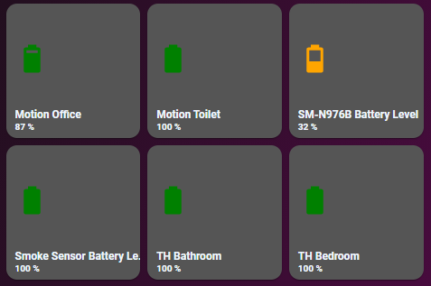

# Homekit Infused

Back to [Addon List](../addon_list.md)

# Auto Filled Battery Card
*HKI Framework 3.4.0 or higher required



### Description
This card is used to automatically fill your battery entities and make a nice overview.

### Configuration
- No additional config required

### Advanced

| Properties | Required | Default | Description |
|----------------------------------|-------------|----------------------------------|----------------------------------------------------------------------------------------------------------------------------------------------------------------------|
| exclude | no | none | Sets the battery entities to be excluded from the card |
| column_num | no | 1 | Sets how many battery entities should be stacked horizontally on each column |
| method | no | name | Sorts the cards in a different order, choose from: domain, entity_id, name, state, attribute, last_changed last_updated or last_triggered |
| grid | no | light-devices-grid | Change the grid of the button, choose from `default-hki-grid`, `light-devices-grid`, `old-hki-grid` or `old-light-devices-grid` |
| size | no | 25% | Change the icon size |
| other | | | It is probably best if you leave all the other settings alone! |

### Install
- Create a new file inside the folder of the view you want (e.g. /homekit-infused/user/views/battery/), you can name the file however you want (e.g. battery-card.yaml)
- Copy the code below and make changes if needed

```
- type: custom:auto-entities
  filter:
    exclude:
      - entity_id: '*battery_state*'
      - domain: input_boolean
      - domain: input_text
      - domain: input_select
      - domain: automation
    include:
      - entity_id: '*battery*'
        options:
          type: custom:button-card
          template:
            - style-default
            - default-hki-grid
            - battery-state
          entity: this.entity_id
          size: 25%
          icon: "[[[ if (states[`this.entity_id`].state < 10) return `mdi:battery-10`; if (states[`this.entity_id`].state < 20) return `mdi:battery-20`; if (states[`this.entity_id`].state < 30) return `mdi:battery-30`; if (states[`this.entity_id`].state < 40) return `mdi:battery-40`; if (states[`this.entity_id`].state < 50) return `mdi:battery-50`; if (states[`this.entity_id`].state < 60) return `mdi:battery-60`; if (states[`this.entity_id`].state < 70) return `mdi:battery-70`; if (states[`this.entity_id`].state < 80) return `mdi:battery-80`; if (states[`this.entity_id`].state < 90) return `mdi:battery-90`; return `mdi:battery`; ]]]"
      - type: custom:button-card
        color_type: blank-card
        aspect_ratio: 1/1
      - type: custom:button-card
        color_type: blank-card
        aspect_ratio: 1/1
  show_empty: false
  sort:
    method: name
    numeric: true
  card:
    type: custom:layout-card
    column_num: 3
    justify_content: start
    layout: horizontal
```
