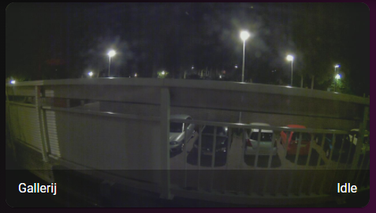

# Homekit Infused

Back to [Addon List](../addon_list.md)

# Auto Filled Cameras Card
*HKI Framework 3.0.2 or higher required



### Description
This card will automatically fetch your camera's and create cards with the same aspect ratio (even if their aspect ratio's do not match to make them look better)

### Configuration
Open your `customize.yaml` file and add the following attribute to your camera entities. If you don't have your camera entities in this file yet then you must create them first. The attribute you will need to add is `type: camera`. Example:
```
camera.living_room:
  friendly_name: Living Room
  type: camera
```
*note: an entity can not have two types, HKI auto filled cards work by filtering the type attribute. This means you can not have an entity auto filled on two views. You can however always create a custom button to do this.

### Advanced

| Properties | Required | Default | Description |
|----------------------------------|-------------|----------------------------------|----------------------------------------------------------------------------------------------------------------------------------------------------------------------|
| aspect_ratio | no | 16x9 | Sets the aspect ratio of the camera image |
| columns | no | 1 | Sets the number of images stacked horizontally |
| sort | no | name | Sorts the cards in a different order, choose from: domain, entity_id, name, state, attribute, last_changed last_updated or last_triggered |
| camera_view | no | auto | Either show a live feed or image on the thumbnail, setting it to live may be heavy on your system (choose between `auto` and `live`) |
| show_name | no | false | Shows the name of the camera |
| show_state | no | false | Shows the state of the camera (if available) |


### Install
- Create a new file inside the folder of the view you want (e.g. /homekit-infused/user/views/security/), you can name the file however you want (e.g. camera-card.yaml)
- Copy the code below and make changes if needed

```
- !include
  - '../../../base/templates/auto-fill/auto-fill-camera-template.yaml'
  - aspect_ratio: 16x9
    columns: 1
    sort: name
```
