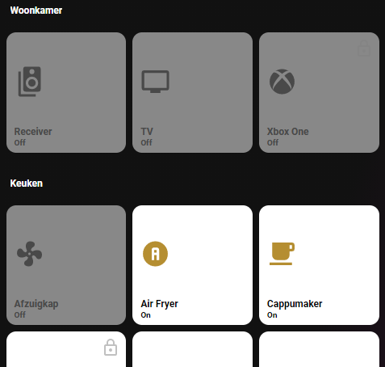

# Homekit Infused

Back to [Addon List](../addon_list.md)

# Auto Filled Devices Card
*HKI Framework 3.0.1 or higher required



### Description
This is an auto filled devices card with a homekit style popup embedded.

### Requirements (HACS)

| Name | Type  | Description |
|----------------------------------|-------------|---------------------------------------------------------------------------------------------------------------------------------------------------------------------------------------------------------|
| [Light Popup Card](https://github.com/DBuit/light-popup-card) | Frontend | This is the popup that opens when holding/double tapping the buttons |

### Resources
Add the following lines to your lovelace resources 
```
/hacsfiles/light-popup-card/light-popup-card.js
```

### Configuration
Open your `customize.yaml` file and add the following attribute to your light entities. If you don't have your light entities in this file yet then you must create them first. The attributes you will need to add is depends on the type you want to use, but you will also need to set a room. You can set the following types:
```
type: switch (for standard switch)
type: xbox (for xbox console)
type: playstation (for playstation console)
type: non-climate-fan (for exhausts, blowers or kitchen hoods)
lock: true/false (if set to true this button will have a lock, it is used to avoid accidental presses)
```

You must also set a room attribute and a name, the roomname can be anything, but it MUST be lowercase!
Example:
```
switch.kitchen_oven:
  friendly_name: Oven
  type: switch
  room: kitchen
```
*note: an entity can not have two types or rooms, HKI auto filled cards work by filtering the type attribute. This means you can not have an entity auto filled on two views. You can however always create a custom button to do this.

Next download the following file `/homekit-infused/user/config/room_config.yaml` from the HKI Framework repo (this is already included if you fresh install HKI 3.0.1) and copy the file to the same folder in your own setup.
Open the file you've just downloaded and enter room names for each floor you want to show on the views. There is a light and a devices view, you will only need to enter room names (in lowercase). If you have a basement, use floor 0. You can manage which rooms to show on the views, since some people might have lights in a specific room but no switches, it would be ugly to show an empty room. This is why the rooms to show are split with devices and lights so you can choose which room to show where. If you don't have rooms on a specific floor, just leave it empty (or remove the line entirely).

*note: if you only use 1 floor, just use floor 0 and delete everything else (make sure you keep both a light and a devices floor)

When using multi floor setups you will have to change the code slightly, you can find the parameters below, there is also example code)

### Advanced

| Properties | Required | Default | Description |
|----------------------------------|-------------|----------------------------------|----------------------------------------------------------------------------------------------------------------------------------------------------------------------|
| state | yes/no | 0 | Sets a floor number, this is needed to create conditions as to when to show what floors (the conditional card is only required when using multiple floors) |
| max_columns | no | 3 | Do NOT touch this!! Use the parameter below for setting the columns! |
| columns | no | 3 | Sets the number of buttons stacked horizontally |
| icon_size | no | 25% | Set the icon size for all the auto filled entities within this card |
| sort | no | name | Sorts the cards in a different order, choose from: domain, entity_id, name, state, attribute, last_changed last_updated or last_triggered |
| grid | no | light-devices-grid | Change the grid of the button, choose from `default-hki-grid`, `light-devices-grid`, `old-hki-grid` or `old-light-devices-grid` |
| _global.devices_rooms_floor_X | yes/no | 0 | Replace `X` with a floor number, this MUST match the state condition when using multi-floor. When using a single floor make sure you use the same floor as defined in room_config.yaml |


### Install
- Create a new file inside the folder of the view you want (e.g. /homekit-infused/user/views/devices/), you can name the file however you want (e.g. devices-card.yaml)
- Copy the code below and make changes if needed

##### Basic, only one floor
```
# lovelace_gen
- type: custom:layout-card
  max_columns: 3
  cards:
    
    - !include
      - '../../../base/templates/auto-fill/auto-fill-devices-template.yaml'
      - rooms: {{ rooms }}
        columns: 3
    
```

##### Multifloor
```
# lovelace_gen
- type: conditional
  conditions:
    - entity: input_select.floor_selector
      state: "0"
  card:
    type: custom:layout-card
    max_columns: 3
    cards:
      
      - !include
        - '../../../base/templates/auto-fill/auto-fill-devices-template.yaml'
        - rooms: {{ rooms }}
          columns: 3
      

- type: conditional
  conditions:
    - entity: input_select.floor_selector
      state: "1"
  card:
    type: custom:layout-card
    max_columns: 3
    cards:
      
      - !include
        - '../../../base/templates/auto-fill/auto-fill-devices-template.yaml'
        - rooms: {{ rooms }}
          columns: 3
      
```

### Extra Information
You can copy the above code and change the state/floor number up to a maximum of 5 floors (since floor 0 is included this means up to floor 4), which should be sufficient for most houses.

At the time of writing the floor selector is hardcoded and a very basic, this will change in the future, however to get you going it is included so you won't get stuck with an empty view.

