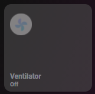

# Homekit Infused

Back to [Addon List](../addon_list.md)

# Auto Filled Fan Card
*HKI Framework 3.0.4 or higher required



### Description
This card will automatically fetch your fans from your customize.yaml file and insert them as entities in here (warning, this card only supports fans that are in the switch domain, fans inside the fan domain will NOT work as of yet)

### Configuration
Open your `customize.yaml` file and add the following attribute to your fan entities. If you don't have your fan entities in this file yet then you must create them first. The attribute you will need to add is `type: camera`. Example:
```
switch.living_room_fan:
  friendly_name: Living Room
  type: fan
  room: living_room
```
*note: an entity can not have two types, HKI auto filled cards work by filtering the type attribute. This means you can not have an entity auto filled on two views. You can however always create a custom button to do this.

### Advanced

| Properties | Required | Default | Description |
|----------------------------------|-------------|----------------------------------|----------------------------------------------------------------------------------------------------------------------------------------------------------------------|
| columns | no | 3 | Sets the number of images stacked horizontally |
| icon_size | no | 25% | Set the icon size for all the auto filled entities within this card |
| sort | no | name | Sorts the cards in a different order, choose from: domain, entity_id, name, state, attribute, last_changed last_updated or last_triggered |
| grid | no | light-devices-grid | Change the grid of the button, choose from `default-hki-grid`, `light-devices-grid`, `old-hki-grid` or `old-light-devices-grid` |

### Install
- Create a new file inside the folder of the view you want (e.g. /homekit-infused/user/views/climate/), you can name the file however you want (e.g. auto-fill-fan-card.yaml)
- Copy the code below and make changes if needed

```
- !include
  - '../../../base/templates/auto-fill/auto-fill-fan-template.yaml'
  - columns: 3
    sort: name
```
