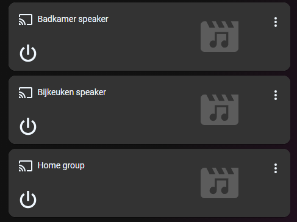

# Homekit Infused

Back to [Addon List](../addon_list.md)

# Auto Filled Media Players Card


### Description
This card will automatically fetch your media players and create cards for them.

### Configuration
- No additional config required 

### Advanced

| Properties | Required | Default | Description |
|----------------------------------|-------------|----------------------------------|----------------------------------------------------------------------------------------------------------------------------------------------------------------------|
| exclude | no | none | Sets the media_player entities to be excluded from the card |
| column_num | no | 1 | Sets how many media players should be stacked horizontally on each column |
| method | no | name | Sorts the cards in a different order, choose from: domain, entity_id, name, state, attribute, last_changed last_updated or last_triggered |

### Install
- Create a new file inside the folder of the view you want (e.g. /homekit-infused/user/views/media/), you can name the file however you want (e.g. auto-fill-media-player-card.yaml)
- Copy the code below and make changes if needed

```
- type: custom:auto-entities
  filter:
    exclude:
      - entity_id: media_player.plex_chrome
      - entity_id: media_player.2651ab215423234hb
    include:
      - domain: media_player
        options:
          type: media-control
          style: |
            ha-card {
              border-radius: var(--border-radius);
              box-shadow: var(--box-shadow);
            }
          entity: this.entity_id
  show_empty: false
  sort:
    method: name
    numeric: true
  card:
    type: custom:layout-card
    column_num: 1
    justify_content: start
    layout: horizontal
```
