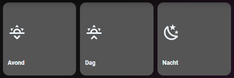

# Homekit Infused

Back to [Addon List](../addon_list.md)

# Auto Filled Scenes Card
*HKI Framework 3.0.2 or higher required



### Description
This is a card that will fetch all your scenes and create a button page for it automatically

### Configuration
- No additional config required

### Advanced

| Properties | Required | Default | Description |
|----------------------------------|-------------|----------------------------------|----------------------------------------------------------------------------------------------------------------------------------------------------------------------|
| column_num | no | 1 | Sets how many battery entities should be stacked horizontally on each column |
| method | no | name | Sorts the cards in a different order, choose from: domain, entity_id, name, state, attribute, last_changed last_updated or last_triggered |
| grid | no | default-hki-grid | Change the grid of the button, choose from `default-hki-grid`, `light-devices-grid`, `old-hki-grid` or `old-light-devices-grid` |
| size | no | 25% | Set the icon size for all the auto filled entities within this card |
| other | | | It is probably best if you leave all the other settings alone! |

### Install
- Create a new file inside the folder of the view you want (e.g. /homekit-infused/user/views/scenes/), you can name the file however you want (e.g. scenes-card.yaml)
- Copy the code below and make changes if needed

```
- type: custom:auto-entities
  filter:
    include:
      - domain: scene
        options:
          !include
          - '../../../base/templates/button/service-call.yaml'
          - entity: this.entity_id
            grid: light-devices-grid
            service_entity: this.entity_id
            show_state: false
            size: 25%
      - type: custom:button-card
        color_type: blank-card
        aspect_ratio: 1/1
      - type: custom:button-card
        color_type: blank-card
        aspect_ratio: 1/1
  sort:
    method: name
    numeric: true
  card:
    type: custom:layout-card
    column_num: 3
    justify_content: start
    layout: horizontal
```

