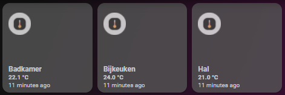

# Homekit Infused

Back to [Addon List](../addon_list.md)

# Auto Filled Sensor Card
*HKI Framework 3.0.1 or higher required



### Description
This is an auto filled sensors card which you can use to sort sensors on different kind of views (see screenshot), you can use this card to show your temperature, humidity or pressure sensors, but also motion/door/window/gas and smoke sensors. Choose the view you want this addon on and paste it!

### Configuration
Open your `customize.yaml` file and add the following attribute to your sensor entities. If you don't have your entities in this file yet then you must create them first. The attribute you will need to add is depends on the type you want to use, you can set the following types:
```
type: temperature (for temperature sensors)
type: humidity (for humidity sensors)
type: pressure (for pressure sensors)
type: door (for doors)
type: window (for windows)
type: motion (for motion sensors)
type: gas (for gas sensors)
type: smoke (for smoke sensors)
```
Here is an example on how to set the types
```
sensor.living_room_temperature:
  friendly_name: Living Room
  type: temperature

binary_sensor.living_room_motion:
  friendly_name: Living Room
  type: motion
```
*note: an entity can not have two types, HKI auto filled cards work by filtering the type attribute. This means you can not have an entity auto filled on two views. You can however always create a custom button to do this.

### Advanced

| Properties | Required | Default | Description |
|----------------------------------|-------------|----------------------------------|----------------------------------------------------------------------------------------------------------------------------------------------------------------------|
| type | yes | none | Sets the type that needs to be auto-filled, use the same type as you have set in your customize.yaml file |
| icon_size | no | 25% | Set the icon size for all the auto filled entities within this card |
| columns | no | 3 | Sets the number of buttons stacked horizontally |
| sort | no | name | Sorts the cards in a different order, choose from: domain, entity_id, name, state, attribute, last_changed last_updated or last_triggered |
| grid | no | default-hki-grid | Change the grid of the button, choose from `default-hki-grid`, `light-devices-grid`, `old-hki-grid` or `old-light-devices-grid` |
| tap_action | no | more-info | Set to show a default more-info window or to do nothing at all, NO other options available! |
| hold_action | no | more-info | Set to show a default more-info window or a mini-graph-card popup (might now work well for some entities), choose from `more-info` or `call-service`, NO other options available, setting this to `call-service` will automatically switch this addons popup cards to a mini-graph! |
| line_color | no | red | Sets the line color for the mini-graph (this only works when using the mini-graph popup, so `hold_action` must be set to `call-service`) |

### Install
- Create a new file inside the folder of the view you want (e.g. /homekit-infused/user/views/climate/), you can name the file however you want (e.g. temperature-sensors-card.yaml)
- Copy the code below and make changes if needed

```
- !include
  - '../../../base/templates/auto-fill/auto-fill-sensors-template.yaml'
  - type: temperature
    tap_action: more-info
    columns: 3
    sort: name
    line_color: blue
```

### Extra Information
For the mini-graph-card to work you must download it through HACS and add the resources to your dashboard! (Only needed when `hold_action` is `call-service`)
*Note: Unfortunately the way the button template is currently written, this popup can only be applied to the hold_action (hold_action and double_tap actions are the same in HKI!). If you really don't want to see the default more-info windows anymore, set `tap_action` to `none`!

### Requirements (HACS)

| Name | Type  | Description |
|----------------------------------|-------------|---------------------------------------------------------------------------------------------------------------------------------------------------------------------------------------------------------|
| [Mini Graph Card](https://github.com/kalkih/mini-graph-card) | Frontend | This is an elegant mini-graph-card for creating cards with graphs and bars |

### Resources
Add the following line to your lovelace resources 
```
/hacsfiles/mini-graph-card/mini-graph-card-bundle.js
```
