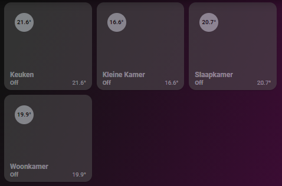
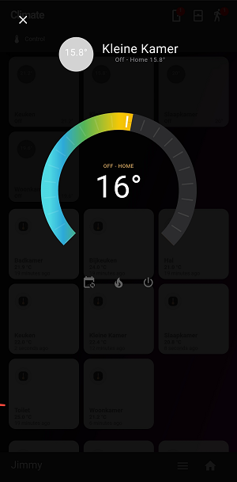

# Homekit Infused

Back to [Addon List](../addon_list.md)

# Auto Filled Thermostat Card
*HKI Framework 3.0.1 or higher required



 
### Description
This is an auto filled thermostat button with a homekit style popup embedded.

### Requirements (HACS)

| Name | Type  | Description |
|----------------------------------|-------------|---------------------------------------------------------------------------------------------------------------------------------------------------------------------------------------------------------|
| [Thermostat Popup Card](https://github.com/DBuit/thermostat-popup-card) | Frontend | This is the popup that opens when holding/double tapping the buttons |

### Resources
Add the following line to your lovelace resources 
```
/hacsfiles/thermostat-popup-card/thermostat-popup-card.js
```

### Configuration
Open your `customize.yaml` file and add the following attribute to your climate entities. If you don't have your climate entities in this file yet then you must create them first. The attribute you will need to add is `type: thermostat`. Example:
```
climate.living_room:
  friendly_name: Living Room
  type: thermostat
```
*note: an entity can not have two types, HKI auto filled cards work by filtering the type attribute. This means you can not have an entity auto filled on two views. You can however always create a custom button to do this.

### Advanced

| Properties | Required | Default | Description |
|----------------------------------|-------------|----------------------------------|----------------------------------------------------------------------------------------------------------------------------------------------------------------------|
| lock | no | false | Sets a lock on the button to avoid accidental presses (unlocking is done by a single tap) |
| columns | no | 3 | Sets the number of images stacked horizontally |
| sort | no | name | Sorts the cards in a different order, choose from: domain, entity_id, name, state, attribute, last_changed last_updated or last_triggered |

### Install
- Create a new file inside the folder of the view you want (e.g. /homekit-infused/user/views/climate/), you can name the file however you want (e.g. thermostat-card.yaml)
- Copy the code below and make changes if needed

```
- !include
  - '../../../base/templates/auto-fill/auto-fill-thermostat-template.yaml'
  - lock: false
    columns: 3
    sort: name
```
