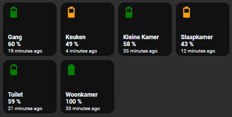

# Homekit Infused 5

## Content
- [Introduction](../index.md)
- [Installation](../installation.md)
- [Configuration](../configuration.md)
- [Addons](../addons.md)
- [Updates](../updates.md)
- [Issues & Questions](../issues.md)
- [About Me](../about.md)
- [Thanks](../thanks.md)

## Addons > Battery

A nice looking HKI styled battery card

You can use any of the following options to modify your addon.

### Stack Config

| Name | Required | Default | Description |
|----------------------------------|-------------|----------------------|-----------------------------------------------------------------------------------------------------------------------------------------------------------------------------------|
| title | no | undefined | Set the title of the stack, ommitting this line will or setting `title: hide` will hide the title |
| columns | no | 3 | Define the number of columns this stack will use |
| [view_layout](layout.md#view-layout) | no | undefined | This is best used in conjunction with the [layout](layout.md#view-layout) addon, but can also be used to control whether to show this stack on different screen sizes. |
| conditional | no | false | Setting this to `true` will make the stack condtional |
| conditions | no | undefined | Add entities and conditions, this will determine when this addon will be shown, e.g. if entity x is turned `on`, then show this addon (see [addons](../addons.md) for examples |
| entities | yes | list of entities | List all your entities you want to show up here |  

```yaml
# views.yaml (example)
  my_view:
    addons:
      battery:
        - title: Hue Dimmers
          columns: 3
          entities:
            - sensor.hallway_hue_dimmer
            - sensor.kitchen_hue_dimmer
            - sensor.office_hue_dimmer
```
```yaml
# views.yaml (example with multiple stacks)
  my_view:
    addons:
      battery:
        - title: Hue Dimmers
          columns: 3
          entities:
            - sensor.hallway_hue_dimmer
            - sensor.kitchen_hue_dimmer
            - sensor.office_hue_dimmer
        - title: IKEA Dimmers
          entities:
            - sensor.office_tradfri_dimmer
            - sensor.bedroom_tradri_dimmer
            - sensor.living_room_tradfri_dimmer
```

#### Battery Extra Options
By default it will get the friendly_name from either the entity itself or when set from customize.yaml. You can however set your own friendly name here if you wanted to.

| Name | Required | Default | Description |
|----------------------------------|-------------|----------------------|-----------------------------------------------------------------------------------------------------------------------------------------------------------------------------------|
| entity | yes | undefined | Set the entity that should be used |
| name | no | undefined | Sets the name of this entity |

```yaml
# views.yaml (extra options)
  my_view:
    addons:
      battery:
        - title: Hue Dimmers
          entities:
            - entity: sensor.hallway_hue_dimmer
              name: Hallway
            - entity: sensor.kitchen_hue_dimmer
              name: Kitchen
            - entity: sensor.office_hue_dimmer
              name: Office
```

### Images:


