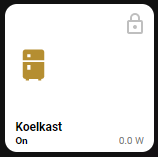

# Homekit Infused
*HKI Framework 3.0.4 or higher required

Back to [Addon List](../addon_list.md)

# Button (Light, Switch or Sensor)


### Description
This is the default HKI switch button, it is by default used in all the addons that have switches in them (e.g. lights and devices auto fill addons).

### Requirements (HACS)

| Name | Type  | Description |
|----------------------------------|-------------|---------------------------------------------------------------------------------------------------------------------------------------------------------------------------------------------------------|
| [Light Popup Card](https://github.com/DBuit/light-popup-card) | Frontend | This is the popup that opens when holding/double tapping the buttons |

*Note: You do not require the above custom-cards IF you set the properties of the hold_action to `none` or `more-info`!

### Resources
Add the following lines to your lovelace resources 
```
/hacsfiles/light-popup-card/light-popup-card.js
```

### Configuration
- You will need to set the name, icon, label and entity (if the entity is set in customize.yaml you can skip name and icon)
- When using a layout-card you can also set a column size, else just use a horizontal-stack to stack buttons
- The options for this button are limited simply for the sake of simplicity, you can use other button addons that have more flexibility in the future
- By default this button has a preprogrammed popup that will by default either show a switch or a slider depending on the type after a hold_action, at the bottom right it will show a settings button that will take you to the more-info window of that entity. Read below on how to change this behaviour.
- If you want to use the button to display a single sensor, you MUST set `hold_action` to `more-info` or `none`.

### Advanced

| Properties | Required | Default | Description |
|----------------------------------|-------------|----------------------------------|----------------------------------------------------------------------------------------------------------------------------------------------------------------------|
| entity | yes | none | Sets the entity used for the button |
| name | yes/no | none | Sets the name for the button, if the entity has a friendly name in customize.yaml this is not required! (this accepts JS templates, see examples below) |
| icon | yes/no | none | Sets the icon for the button, if an entity_picture is set either in this config or in customize.yaml, the icon will be hidden! if this entity has an icon set in customize.yaml this is not required (this accepts JS templates, see examples below) |
| size | no | 25% | Sets the size of the icon |
| color | no | auto | Sets the color of the icon when device is turned `on` (this will ONLY work with entities that report `on` and `off` states) |
| icon_color_off | no | var(--paper-item-icon-color) | Sets the color of the icon when device is turned `off` (this will ONLY work with entities that report `on` and `off` states) |
| label | yes | `!include ../../../base/includes/brightness-label.yaml` | Sets the label for the button (this accepts JS templates, see examples below) |
| show_entity_picture | no | true | Set to show entity_picture instead of an icon, set this to false if you've set an entity_picture in customize.yaml and want to override it by showing an icon instead, else just leave the default setting | 
| entity_picture | no | none | Sets an entity_picture for this icon, this must be a path to an image (e.g. /local/images/your_image.png). This will override the icon setting! |
| aspect_ratio | no | 1/1 | Sets the aspect_ratio for the button |
| lock | no | false | Sets if the button will be locked, you can unlock a button by a tap, you will need to press it again to activate (this is useful to avoid accidental presses) |
| show_name | no | true | Show/hide the name on the button |
| show_label | no | true | Show/hide the label on the button |
| show_icon | no | true | Show/hide the icon on the button |
| show_state | no | true | Show/hide the state on the button |
| show_last_changed | no | false | Show/hide the state of the entities last activity on the button, this is best used when setting a sensor entity (this might not work nicely with the included grid, if it doesn't remove the grid line from this button's config) |
| spin_on | no | false | If the entity has `on` and `off` states you can make the icon spin when the device is turned on by setting this to true |
| spin_off | no | false | If the entity has `on` and `off` states you can make the icon spin when the devices is turned off by setting this to true |
| opacity_off | no | 0.5 | When entities are turned off, the opacity of this button is 0.5, you can set values from 0.0 to 1.0, where 0.0 is completely transparant and 1.0 completely opaque |
| ha-card-background | no | white | By default when you turn on a device in HKI the button turns white, this sets the color of the button when the device is turned `on` (this will ONLY work with entities that report `on` and `off` states) |
| tap_action | no | toggle | The options here are limited, choose between `toggle`, `more-info` or `none` |
| hold_action | no | service-call | The options here are limited, choose between `toggle`, `more-info`, `none` or `service-call` (the service-call can't be edited and will always show a switch popup with a more-info card) |
| template | no | `'../popup-cards/light-switch.yaml'` | Only change this if you need a different popup for your lights, by default you have the choice between `light-switch.yaml`, `light-rgb.yaml` and `light-color-temp.yaml`, but you could copy one of these light templates from the base folder and create your own (which is useful if you want to change the preset colors in the popup) |
| grid | no | default-hki-grid | Change the grid of the button, choose from `default-hki-grid`, `light-devices-grid`, `old-hki-grid` or `old-light-devices-grid` |

##### Popup Settings
*Requires HKI Framework 3.0.5 or higher

*If you don't need any changes to the popups or if you have set the hold_action to be a more-info or none action you can skip this part!

You can add different settings to the popups, the `display_type` and `slider_height` will work with all three popup templates (light-switch.yaml light-rgb.yaml and light-color-temp.yaml). All other settings will ONLY work with the light-rgb.yaml popup!

You should try to match the colors from the image to the color you are actually calling the service for. Unfortunately the image shown needs a hex color and the service called wants an rgb color. To find out color names you can check out the [Google Color Picker](https://www.google.com/search?q=color+picker&oq=color+picker&aqs=chrome..69i57j35i39j0l6.1308j0j4&sourceid=chrome&ie=UTF-8).

| Properties | Required | Default | Description |
|----------------------------------|-------------|----------------------------------|----------------------------------------------------------------------------------------------------------------------------------------------------------------------|
display_type | no | auto | Force a `slider` or a `switch`, else set to `auto` |
slider_height | no | 410px | Sets the height for the switch/slider |
||||
slider_colored_by_light | no | true | Set the slider to have the same color as the light currently is |
color_1 | no | '#ff8800' | Sets the image color of the upper left preset (must be a hex value) |
color_2 | no | '#ff005f' | Sets the image color of the upper middle preset (must be a hex value) |
color_3 | no | '#28ff00' | Sets the image color of the upper right preset (must be a hex value) |
color_4 | no | '#00a0ff' | Sets the image color of the lower left preset (must be a hex value) |
color_5 | no | '#8300ff' | Sets the image color of the lower middle preset (must be a hex value) |
color_6 | no | '#0300ff' | Sets the image color of the lower right preset (must be a hex value) |
service_color_1 | no | [255, 136, 0] | Sets the color of the actual service-call (must be a rgb value) |
service_color_2 | no | [255, 0, 95] | Sets the color of the actual service-call (must be a rgb value) |
service_color_3 | no | [40, 255, 0] | Sets the color of the actual service-call (must be a rgb value) |
service_color_4 | no | [0, 160, 255] | Sets the color of the actual service-call (must be a rgb value) |
service_color_5 | no | [131, 0, 255] | Sets the color of the actual service-call (must be a rgb value) |
service_color_6 | no | [3, 0, 255] | Sets the color of the actual service-call (must be a rgb value) |


### Install
- Create a new file inside the folder of the view you want (e.g. /homekit-infused/user/views/lights/), you can name the file however you want (e.g. custom-buttons.yaml)
- Copy the code below and make changes if needed

```
# minimal example (light)
- !include
  - '../../../base/templates/button/button.yaml'
  - entity: light.living_room_lamp
    name: Living Room
    label: !include ../../../base/includes/brightness-label.yaml
    icon: mdi:floor-lamp
```
```
# minimal example (switch)
- !include
  - '../../../base/templates/button/button.yaml'
  - entity: switch.washing-machine
    name: Washing
    label: Machine
    icon: mdi:washing-machine
```
```
# example of a button with the default toggle/more-info
- !include
  - '../../../base/templates/button/button.yaml'
  - entity: switch.washing-machine
    name: Washing
    label: Machine
    icon: mdi:washing-machine
    hold_action: more-info
```
```
# example of a button with a sensor and last_changed label
- !include
  - '../../../base/templates/button/button.yaml'
  - entity: sensor.woonkamer
    lock: false
    tap_action: more-info
    hold_action: none
    show_last_changed: true
```
```
# example (this is how I have set them up personally in my own setup)
- !include
  - '../../../base/templates/button/button.yaml'
  - entity: light.bedside_lamp_wife
    name: Stephanie
    label: !include ../../../base/includes/brightness-label.yaml
    lock: true
    template: '../popup-cards/light-color-temp.yaml'
    grid: light-devices-grid
```

### Templating
Some of the properties accept templating, unfortunately I do not know all of the stuff that is possible with this and documenting it would be a crazy mans job, so for more examples than the ones I provide here I will suggest you check out the following two pages.
- https://github.com/custom-cards/button-card
- https://community.home-assistant.io/t/lovelace-button-card/65981

```
# example with a name, label and icon template
- !include
  - '../../../base/templates/button/button.yaml'
  - entity: switch.washing-machine
    name: "[[[ if (states['switch.washing-machine'].state == "on") return 'Washing Machine'; else return 'Doing Nothing Machine' ]]]"
    label: "[[[ if (states['switch.washing-machine'].state == "on") return 'Turned On'; else return 'Stupid Machine'; ]]]"
    icon: "[[[ if (states['switch.washing-machine'].state == "on") return 'mdi:washing-machine'; else return 'mdi:power'; ]]]"
```
The example below is how to easily create a template to show as the label, I use this for example to show the energy readings of a certain device that uses a different entity.



```
# example device switch with energy monitoring (this is how I personally use this button)
- !include
  - '../../../base/templates/button/button.yaml'
  - entity: switch.refrigerator
    grid: light-devices-grid
    label: "[[[ return `${states['sensor.refrigerator_power'].state} W`; ]]]"
    lock: true
```

### Layout card and horizontal/vertical stacks
I know the HA documentation has this perfectly explained already, but to make it easier on you I will try to explain in more detail [here](../addons/stacks.md)
