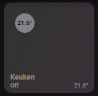

# Homekit Infused

Back to [Addon List](../addon_list.md)

# Button (Thermostat)



 
### Description
This is the default HKI thermostsat button, it is by default used in the [auto-fill-thermostats-card](auto-fill-thermostats-card.md) but can also be used anywhere else like on the frontpage or well, on any view you would like.

### Requirements (HACS)

| Name | Type  | Description |
|----------------------------------|-------------|---------------------------------------------------------------------------------------------------------------------------------------------------------------------------------------------------------|
| [Thermostat Popup Card](https://github.com/DBuit/thermostat-popup-card) | Frontend | This is the popup that opens when holding/double tapping the buttons |

### Resources
Add the following line to your lovelace resources 
```
/hacsfiles/thermostat-popup-card/thermostat-popup-card.js
```

### Configuration
- For this card to work you MUST set an ambient_entity and the attributes
- This will change in an update where these two properties will no longer be a requirement
- The (external) ambient entity only reflects the temperature in the button, it will not change the behavior of your thermostat. Any offsets you'd like to create to your actual thermostat (e.g. Tado) must be done either within the respective app (e.g. Tado app) or done with automations in HA/Node Red (I do not provide these automations!)

### Advanced

| Properties | Required | Default | Description |
|----------------------------------|-------------|----------------------------------|----------------------------------------------------------------------------------------------------------------------------------------------------------------------|
| entity | yes | none | Sets the climate entity, note that you MUST add this entity as the ambient_entity if you don't use an external sensor |
| lock | no | false | Sets a lock on the button to avoid accidental presses (unlocking is done by a single tap) |
| ambient_entity | yes | none | Sets the ambient temperature sensor, this can be handy when using e.g. Tado which doesn't always reflect the correct room temperature. This settings lets you set a different entity as the ambient sensor. If you don't have a separate entity sensor enter your climate entity here instead! (the same as used as the main entity for this card) |
| attributes | yes | attributes.current_temperature / state | This can be used to change the attribute name or to use the state instead. You need to use this if your entity uses a different attribute or a different state. When you only need a state use `state` if you need to use an attribute always start with `attribute.` e.g. `attribute.temperature` |

### Install
- Create a new file inside the folder of the view you want (e.g. /homekit-infused/user/views/climate/), you can name the file however you want (e.g. thermostat-card.yaml)
- Copy the code below and make changes if needed

```
# example of a basic climate entity
- !include
  - '../../../base/templates/button/thermostat.yaml'
  - entity: climate.living_room
    lock: false
    ambient_entity: climate.living_room
    attributes: attributes.current_temperature
```
```
# example of a basic climate entity with external temperature sensor
- !include
  - '../../../base/templates/button/thermostat.yaml'
  - entity: climate.living_room
    lock: false
    ambient_entity: sensor.living_room_temperature
    attributes: state
```
