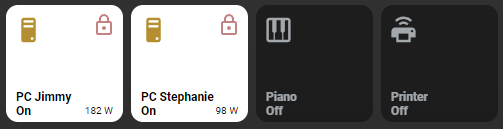
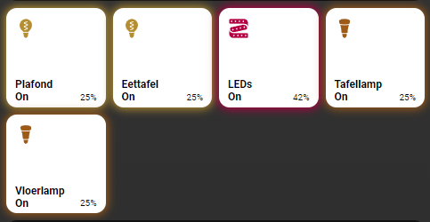
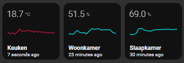
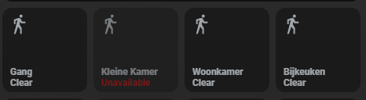
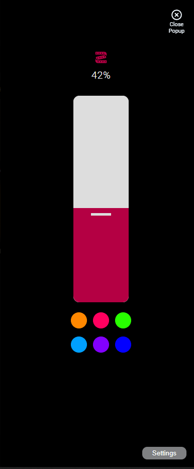
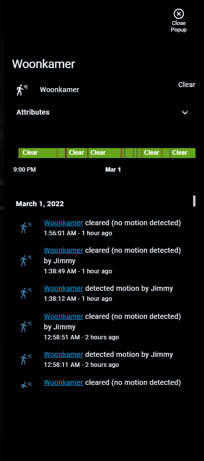

# Homekit Infused 5

## Content
- [Introduction](../index.md)
- [Installation](../installation.md)
- [Configuration](../configuration.md)
- [Addons](../addons.md)
- [Updates](../updates.md)
- [Issues & Questions](../issues.md)
- [About Me](../about.md)
- [Thanks](../thanks.md)

## Addons > Button

This addon lets you fill your views with very powerful buttons!

### HACS Requirements

| Name | Type  | Description |
|----------------------------------|-------------|---------------------------------------------------------------------------------------------------------------------------------------------------------------------------------------------------------|
| [Light Popup Card](https://github.com/DBuit/light-popup-card) | Frontend | This is a popup that opens when holding/double tapping buttons, you need to add this repository MANUALLY in HACS |
| [More Info Card](https://github.com/thomasloven/lovelace-more-info-card) | Frontend | This is the card that shows a standard HA styled color wheel in conjunction with the light popup card |
| [Mini Graph Card](https://github.com/kalkih/mini-graph-card) | Frontend | Mini Graph Card gives the possibility to create more advanced graphs! |

**NOTE:** this addon is just a preconfigured [custom:button-card](https://github.com/custom-cards/button-card) template. You can use 99,9% of the options that are available in that card, HKI however has some extra options/configuration that can not be found in that card.

You can use any of the following options to modify your addon.

### Stack Config

| Name | Required | Default | Description |
|----------------------------------|-------------|----------------------|-----------------------------------------------------------------------------------------------------------------------------------------------------------------------------------|
| title | no | undefined | Set the title of the stack, ommitting this line will or setting `title: hide` will hide the title |
| columns | no | 3 | Define the number of columns this stack will use |
| square | no | true | Set if the buttons should be square or not, this is only useful when you set individual aspect_ratios in the config below |
| lock | no | false | this locks the entire stack and will now need two taps to turn on/off, the first tap unlocks, the second toggles |
| [view_layout](layout.md#view-layout) | no | undefined | This is best used in conjunction with the [layout](layout.md#view-layout) addon, but can also be used to control whether to show this stack on different screen sizes. |
| type | no | undefined | Setting a type can make the stack condtional, this option will ONLY accept `conditional` |
| conditions | no | undefined | Add entities and conditions, this will determine when this addon will be shown, e.g. if entity x is turned `on`, then show this addon (see [addons](../addons.md) for examples |
| entities | yes | list of entities | List all your entities you want to show up here |

### Button Options

By default you must enter an array of entities like in the examples below, this does not need extra options and will just get the global name/icon.
You must define it as an object instead to make use of the options below.

| Name | Required | Default | Description |
|----------------------------------|-------------|----------------------|-----------------------------------------------------------------------------------------------------------------------------------------------------------------------------------|
| entity | yes | undefined | Set the entity used |
| type | no | auto | This forces a button to be seen by HKI as a specific type, which alters the appearance. Choose between `rgb`, `color-temp`, `switch`, or `graph` or `fan`. By default HKI tries to figure out itself what kind of type the button is, but if it gets it wrong force it by setting the type |
| name | no | global_name | Set a name for this button, this accepts [JS templates](https://github.com/custom-cards/button-card#javascript-templates) |
| label | no | none | Set a label for this button, this accepts [JS templates](https://github.com/custom-cards/button-card#javascript-templates) |
| icon | no | global_icon | Set an icon for this button, this accepts [JS templates](https://github.com/custom-cards/button-card#javascript-templates) |
| [state_display](https://github.com/custom-cards/button-card#javascript-templates) | no | undefined | Override the way the state is displayed, this accepts [JS templates](https://github.com/custom-cards/button-card#javascript-templates) |
| entity_picture | no | global_entity_picture | Set an entity picture for this button, note that when an entity_picture is set in either customize.yaml or here, that it will take priority over an icon, unless you set `show_entity_picture: false`, this accepts [JS templates](https://github.com/custom-cards/button-card#javascript-templates) |
| background_image | no | undefined | Set an URL or a `/local/*` to an image to show as background |
| lock | no | false | this locks this button and will now need two taps to turn on/off, the first tap unlocks, the second toggles |
| aspect_ratio | no | 1/1 | Set a custom aspect_ratio for this button, note that you will want to set `square: false` in the stacks configuration when setting anything other than 1/1 |
| size | no | 25% | Set the icon size, note that this setting is not always working as expected due to the grid used, play around with it |
| units | no | undefined | Override or define the units to display after the state of the entity. If omitted, it's using the entity's units |
| button_badge | no | undefined | Use the HKI predefined badge in your button, you MUST define an entity to use, you can only use it's state! |
| icon_color_active | no | undefined | Use this to override the icon color when the entity is active, this accepts [JS templates](https://github.com/custom-cards/button-card#javascript-templates) |
| icon_color_inactive | no | undefined | Use this to override the default icon color, this accepts [JS templates](https://github.com/custom-cards/button-card#javascript-templates) |
| show_name | no | true | Choose to show/hide the name, set to `false` to hide it |
| show_label | no | true | Choose to show/hide the label, set to `false` to hide it |
| show_icon | no | true | Choose to show/hide the icon, set to `false` to hide it |
| show_state | no | true | Choose to show/hide the state, set to `false` to hide it |
| show_last_changed | no | false | Choose to show/hide the last_changed state, set to `true` to show it, note that this will replace the label! |
| show_live_stream | no | false | If a camera entity is set, show a live stream instead of still images |
| show_units | no | true | Choose to show/hide the units, set to `false` to hide it |
| show_entity_picture | no | true | Choose to show/hide the entity_picture, set to `false` to hide it |
| [confirmation](https://github.com/custom-cards/button-card#confirmation) | no | undefined | Display a confirmation popup. See [official documentation](https://github.com/custom-cards/button-card#confirmation) for more information |
| template | no | undefined | By default this button will take on the HKI default style, you can set `template: empty` to clear it and use your own styles |
| [layout](https://github.com/custom-cards/button-card#Layout) | no | undefined | The layout of the button can be modified using this option, you MUST set `template: empty` for this to work properly. See [official documentation](https://github.com/custom-cards/button-card#Layout) for more information |
| [triggers_update](https://github.com/custom-cards/button-card#triggers_update) | no | undefined | entity_id list that would trigger a card update. See [official documentation](https://github.com/custom-cards/button-card#triggers_update) for more information |
| [group_expand](https://github.com/custom-cards/button-card#triggers_update) | no | false | if any of the entities triggering a card update is a group, it will auto-expand the group and the card will update on any child entity state change. This works with nested groups too. See [official documentation](https://github.com/custom-cards/button-card#triggers_update) for more information |
| spin | no | false | Set this to `true` if you want the icon to spin when the state is `on` |
| [styles](https://github.com/custom-cards/button-card#styles) | no | predefined | Set your own styles to the button, this is best used with `template: empty`. See [official documentation](https://github.com/custom-cards/button-card#styles) for more information |
| [extra_styles](https://github.com/custom-cards/button-card#injecting-css-with-extra_styles) | no | undefined | Set extra styles. See [official documentation](https://github.com/custom-cards/button-card#injecting-css-with-extra_styles) for more information | 
| [state](https://github.com/custom-cards/button-card#State) | no | predefined | Set custom styles per state, must be an object list! See [official documentation](https://github.com/custom-cards/button-card#State) for more information |
| [custom_fields](https://github.com/custom-cards/button-card#Custom-Fields) | no | predefined | Set custom fields with your custom styles. See [official documentation](https://github.com/custom-cards/button-card#Custom-Fields) for more information |
| [tap_action](https://github.com/custom-cards/button-card#Action) | no | predefined | Set a custom tap_action for your button, by default HKI uses a different action automatically depending on the entity domain. See [official documentation](https://github.com/custom-cards/button-card#Action) for more information |
| [hold_action](https://github.com/custom-cards/button-card#Action) | no | predefined | Set a custom hold_action for your button, by default HKI uses a different action automatically depending on the entity domain. See [official documentation](https://github.com/custom-cards/button-card#Action) for more information |
| [double_tap_action](https://github.com/custom-cards/button-card#Action) | no | predefined | Set a custom double_tap_action for your button, by default HKI uses a different action automatically depending on the entity domain. See [official documentation](https://github.com/custom-cards/button-card#Action) for more information |

```yaml
# views.yaml (example simple, no extra options)
  living_room:
    addons:
      button:
        - title: Living Room
          columns: 3
          entities:
            - switch.receiver
            - switch.samsung_tv
            - switch.xbox_one
```
```yaml
# views.yaml (example simple, multiple stacks)
  living_room:
    addons:
      button:
        - title: Living Room
          square: false
          entities:
            - switch.receiver
            - switch.samsung_tv
            - switch.xbox_one
        - title: Bedroom
          columns: 3
          entities:
            - switch.receiver
            - switch.samsung_tv
            - switch.xbox_one
```
```yaml
# views.yaml (example with extra options)
  living_room:
    addons:
      button:
        - title: Living Room
          entities:
            - entity: switch.receiver
              icon: mdi:speakers
              label: My Speaker
            - entity: switch.samsung_tv
              name: TV
            - entity: switch.xbox_one
              lock: true
            - entity: sensor.livingroom_temperature
              type: graph
```
#### HKI Specific Button Types Extra Options

Some buttons get some extra options if you set `type: graph`, `type: switch`, `type: rgb` and `type: color-temp`.

| Name | Required | Default | Description |
|----------------------------------|-------------|----------------------|-----------------------------------------------------------------------------------------------------------------------------------------------------------------------------------|
| popup_style | no | auto | When having `type: switch`, `type: rgb` or `type: color-temp`, you can force the popup to be either `switch` or a `slider` |
||||
| line_color | no | red | When having `type: graph` you can set the line_color, this can be a css name or a hex value (e.g. Red or '#FF22FF') |
| graph_type | no | line | When having `type: graph` you can change the graph_type between `bar` or `line` |

#### Tips
By default the label is either the brightness of a light or empty, however with button-card JS templates you can have a cool label like this



```yaml
# views.yaml (example with custom label)
  my_view:
    addons:
      button:
        - title: Laundry Room
          entities:
            - entity: switch.washing_machine
              lock: true
              label: "[[[ return `${states['sensor.washing_machine_power'].state} W`; ]]]"
```

The same is true for icons and you can template an icon to be different for each state:

```yaml
# views.yaml (example with custom icon)
  my_view:
    addons:
      button:
        - title: Laundry Room
          entities:
            - entity: switch.washing_machine
              icon: "[[[ if (entity.state == 'on') return `mdi:lamp`; else return `mdi:floor-lamp` ]]]"
```

### Images:










