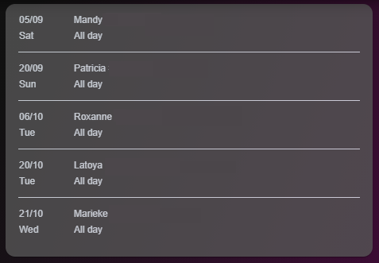

# Homekit Infused

Back to [Addon List](../addon_list.md)

# Calendar Card


### Description
This is a calendar card for use with calendar entities.

### Requirements (HACS)

| Name | Type  | Description |
|----------------------------------|-------------|---------------------------------------------------------------------------------------------------------------------------------------------------------------------------------------------------------|
| [Calendar Card](https://github.com/ljmerza/calendar-card) | Frontend | This is a calendar card, see screenshot for details (this example is a birthday card) |

### Resources
Add the following line to your lovelace resources 
```/hacsfiles/calendar-card/calendar-card.js```

### Configuration
- To use this you can simply change the entity and the name (which is the city name)
- Experienced users can add way more options to the card, visit https://github.com/ljmerza/calendar-card for all options

### Advanced

| Parameters | Type | Default | Description |
|----------------------------------|-------------|----------------------------------|----------------------------------------------------------------------------------------------------------------------------------------------------------------------|
| entities | List | none | Sets the calendar entity or entities used for this card |
| numberOfDays | Integer | 60 | Sets the number of days ahead shown on the card |
| dateTopFormat | String | DD/MM | Sets the date format |

### Install
- Create a new file inside the folder of the view you want (e.g. /homekit-infused/user/views/calendar/), you can name the file however you want (e.g. calendar-card.yaml)
- Copy the code below and make changes if needed

```
- type: horizontal-stack
  cards:
    - !include ../../../base/includes/gap.yaml
    - type: custom:calendar-card
      style: |
        ha-card {
          border-radius: var(--border-radius);
          box-shadow: var(--box-shadow);
          font-family: Helvetica;
          font-size: 12px;
          opacity: 0.8;
          overflow: hidden;
        }
      numberOfDays: 60
      dateTopFormat: DD/MM
      hideHeader: true
      entities:
        - calendar.family
      showColors: true
    - !include ../../../base/includes/gap.yaml
```

