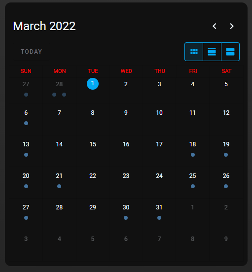

# Homekit Infused 5

## Content
- [Introduction](../index.md)
- [Installation](../installation.md)
- [Configuration](../configuration.md)
- [Addons](../addons.md)
- [Updates](../updates.md)
- [Issues & Questions](../issues.md)
- [About Me](../about.md)
- [Thanks](../thanks.md)

## Addons > Calendar

The Home Assistant core calendar card

You can use any of the following options to modify your addon.

### Stack and Addon Config

| Name | Required | Default | Description |
|----------------------------------|-------------|----------------------|-----------------------------------------------------------------------------------------------------------------------------------------------------------------------------------|
| title | no | undefined | Set the title of the stack, ommitting this line will or setting `title: hide` will hide the title |
| show_title | no | true | Show or hide the stack title |
| initial_view | no | dayGridMonth | Choose between `dayGridMonth`, `dayGridDay`, and `listWeek` |
| [view_layout](layout.md#view-layout) | no | undefined | This is best used in conjunction with the [layout](layout.md#view-layout) addon, but can also be used to control whether to show this stack on different screen sizes. |
| conditional | no | false | Setting this to `true` will make the stack condtional |
| conditions | no | undefined | Add entities and conditions, this will determine when this addon will be shown, e.g. if entity x is turned `on`, then show this addon (see [addons](../addons.md) for examples |
| entities | yes | list of entities | Set your calendar entity/entities here, you can define more than one entity per stack  |

```yaml
# views.yaml (example)
  my_view:
    addons:
      calendar:
        - title: Birthdays
          initial_view: dayGridMonth
          entities: 
            - calendar.contacts
```   
```yaml
# views.yaml (example multiple stacks)
  my_view:
    addons:
      calendar:
        - title: Birthdays
          initial_view: dayGridMonth
          entities: 
            - calendar.contacts
            - calendar.birthdays
        - title: Reminders
          initial_view: dayGridMonth
          entities: 
            - calendar.reminders
```               

### Images:


