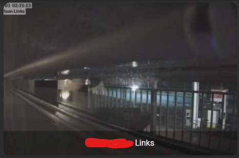

# Homekit Infused 5

## Content
- [Introduction](../index.md)
- [Installation](../installation.md)
- [Configuration](../configuration.md)
- [Addons](../addons.md)
- [Updates](../updates.md)
- [Issues & Questions](../issues.md)
- [About Me](../about.md)
- [Thanks](../thanks.md)

## Addons > Camera

Quickly show your camera's on any view!

You can use any of the following options to modify your addon.

### Stack Config

| Name | Required | Default | Description |
|----------------------------------|-------------|----------------------|-----------------------------------------------------------------------------------------------------------------------------------------------------------------------------------|
| title | no | undefined | Set the title of the stack, ommitting this line will or setting `title: hide` will hide the title |
| columns | no | 3 | Define the number of columns this stack will use |
| aspect_ratio | no | 16x10 | Set an aspect ratio for all the cameras in this stack |
| [view_layout](layout.md#view-layout) | no | undefined | This is best used in conjunction with the [layout](layout.md#view-layout) addon, but can also be used to control whether to show this stack on different screen sizes. |
| type | no | undefined | Setting a type can make the stack condtional, this option will ONLY accept `conditional` |
| conditions | no | undefined | Add entities and conditions, this will determine when this addon will be shown, e.g. if entity x is turned `on`, then show this addon (see [addons](../addons.md) for examples |
| entities | yes | list of entities | List all your entities you want to show up here |

### Cameras Extra Options
By default you must enter an array of entities like in the examples below, this does not need extra options.
You can define an entity as an object instead to make use of the options below. See examples.

| Name | Required | Default | Description |
|----------------------------------|-------------|----------------------|-----------------------------------------------------------------------------------------------------------------------------------------------------------------------------------|
| entity | yes | undefined | Set the entity used |
| aspect_ratio | no | 16x10 | Set a custom aspect_ratio for this camera |
| show_state | no | false | Choose to show the state of this camera |
| camera_view | no | false | Choose between `auto` or `live`. Live will make the card show a live view, note that this might be heavy on your resources, it is recommended to keep this set to `auto` unless you really want this |

Examples:

```yaml
# views.yaml (example basic)
my_view:
  addons:
    camera:
      - title: Unifi Camera's
        entities:
          - camera.living_room
          - camera.bedroom
```
```yaml
# views.yaml (example multiple stacks)
my_view:
  addons:
    camera:
      - title: Unifi Camera's
        entities:
          - camera.living_room
          - camera.bedroom
      - title: Xiaomi Camera's
        entities:
          - camera.frontdoor
          - camera.kitchen
```
```yaml
# views.yaml (example with extra options)
my_view:
  addons:
    camera:
      - title: Unifi Camera's
        entities:
          - entity: camera.living_room
            aspect_ratio: 4x3
          - entity: camera.bedroom
            camera_view: live
```
```yaml
# views.yaml (example mixed)
my_view:
  addons:
    camera:
      - title: Unifi Camera's
        entities:
          - entity: camera.living_room
            aspect_ratio: 4x3
          - camera.bedroom
```
```yaml
# views.yaml (example global stack settings)
my_view:
  addons:
    camera:
      - title: Unifi Camera's
        aspect_ratio: 16x9
        entities:
          - camera.living_room
          - camera.bedroom
```

#### Camera Tip
Since camera's are rendered before most other addons we can make really cool views. Having multiple camera's in a row on the desktop.
The example below will show all 4 camera's horizontally and below that a stack of buttons showing motion.
```yaml
# views.yaml (example with the layout addon)
my_view:
  layout:
    layout_type: custom:horizontal-layout
    layout:
      max_cols: 4
  addons:
    camera:
      - entities:
          - camera.living_room
      - entities:
          - camera.bedroom
      - entities:
          - camera.frontdoor
      - entities:
          - camera.backyard
    button:
      - title: Motion Sensors
        columns: 4
        entities:
          - binary_sensor.living_room
          - binary_sensor.bedroom
          - binary_sensor.frontdoor
          - binary_sensor.backyard
```

### Images:


