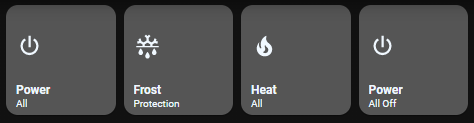

# Homekit Infused

Back to [Addon List](../addon_list.md)

# Climate Preset Buttons
*Homekit Infused Framework 3.0.3 or higher required



### Description
This is a predefined set of buttons to use with your climate entities. It is advised to put this on your climate view. 

### Configuration
- The addon is plug and play and should work immediately without any adjustments
- Please change the parameters you need to set below if you do need to change something

### Advanced

| Properties | Required | Default | Description |
|----------------------------------|-------------|----------------------------------|----------------------------------------------------------------------------------------------------------------------------------------------------------------------|
| name | yes | none | Sets the name of the button |
| label | yes | none | Sets the label of the button |
| icon | yes | none | Sets the icon of the button |
| option | yes | none | Sets the temperature preset of the button |
| grid | no | default-hki-grid | Change the grid of the button, choose from `default-hki-grid`, `light-devices-grid`, `old-hki-grid` or `old-light-devices-grid` |
| other | | | Do NOT touch the other stuff! |

### Install
- Create a new file inside the folder of the view you want (e.g. /homekit-infused/user/views/climate/), you can name the file however you want (e.g. climate-presets-card.yaml)
- Copy the code below and make changes if needed

```
- type: horizontal-stack
  cards:
    - !include
      - '../../../base/templates/button/service-call.yaml'
      - name: Power
        label: All
        icon: mdi:power
        service: climate.turn_on
        service_entity: all
        margin_right: 40px
        opacity_off: 0.8
    - !include
      - '../../../base/templates/button/service-call-with-option.yaml'
      - name: Frost
        label: Protection
        icon: mdi:snowflake-melt
        service: climate.set_temperature
        service_entity: all
        extra: temperature
        option: 11
        margin_right: 40px
        opacity_off: 0.8
    - !include
      - '../../../base/templates/button/service-call-with-option.yaml'
      - name: Heat
        label: All
        icon: mdi:fire
        service: climate.set_temperature
        service_entity: all
        extra: temperature
        option: 22
        margin_right: 40px
        opacity_off: 0.8
    - !include
      - '../../../base/templates/button/service-call.yaml'
      - name: Power
        label: All Off
        icon: mdi:power
        service: climate.turn_off
        service_entity: all
        margin_right: 40px
        opacity_off: 0.8
```

