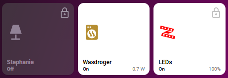

# Homekit Infused
*HKI Framework 3.2.0 or higher required

Back to [Addon List](../addon_list.md)

# Button (custom) *note: this button is meant for intermediate/experienced users, starting home assistant users should consider using any of the other buttons instead)



### Description
This is a button that has the HKI styles but can further be manipulated in ANY way you want. Because rewriting documentation seems pointless find all the options here https://github.com/custom-cards/button-card

### Configuration
- To get the HKI styles you need to do 2 things, add the style and add the grid (see advanced section)
- All other properties can be changed as mentioned in the button-card documentation.
- When using the HKI template styles/grids you won't need to add these yourself (and thus you can skip these options when creating your card)

### Advanced

| Properties | Required | Default | Description |
|----------------------------------|-------------|----------------------------------|----------------------------------------------------------------------------------------------------------------------------------------------------------------------|
| style | no | style-default | Sets the default HKI style (see example below) |
| grid | no | default-hki-grid | Change the grid of the button, choose from `default-hki-grid`, `light-devices-grid`, `old-hki-grid` or `old-light-devices-grid` |
| other |  |  | For the other options please refer to the button-card documentation |

### Install
- Create a new file inside the folder of the view you want (e.g. /homekit-infused/user/views/lights/), you can name the file however you want (e.g. custom-buttons.yaml)
- Copy the code below and make changes if needed

```
# minimal example
- type: custom:button-card
  template:
    - style-default
    - default-hki-grid
  entity: switch.button_1
```
```
# example
- type: custom:button-card
  template:
    - style-default
    - default-hki-grid
  entity: switch.button_1
  name: Switch
  icon: mdi:switch
  tap_action:
    action: toggle
    haptic: light
  hold_action:
    action: call-service
    service: script.turn_on
    service_data:
      entity: script.your_script
```

### Layout card and horizontal/vertical stacks
I know the HA documentation has this perfectly explained already, but to make it easier on you I will try to explain in more detail [here](../addons/stacks.md)
