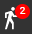
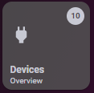

# Homekit Infused
*This documentation applies to HKI Framework 3.0.5 or higher!

Back to [Addon List](../addon_list.md)

# Device Counters
 

### Description
By default HKI has device counters to create sensors that will show you the amount of devices/lights etc that are on at this very moment.

### Configuration
- This was actually a step that you had to do when installing the framework, however if you've missed it check below
- Open `/homekit-infused/user/device_counters.yaml` and fill your entities in there
- Do NOT skip any of the groups! Do NOT delete ANY of the groups!
- If you don't have entities for a certain group, you should put `input_boolean.empty` in its place to avoid errors!
- After editing the device_counters.yaml file you must reload groups or restart Home Assistant!

### Install
- This is part of the HKI Framework and doesn't require a separate install

### Header Configuration
The following three groups are used from device_counters.yaml to show the status of these in the header.
```
all_door_sensor_entities:
all_window_sensor_entities:
all_motion_sensor_entities:
```

### Extra Information
When filling this file you get a few sensors that you can use in your setup. By default the header sensors should work out of the box (provided that you filled the device_counters.yaml file)
You can use the sensors anywhere you like (for example inside of a navigation button), below is a list of all the available sensors you can use. You can find the documentation of how to setup a badge inside a button [here](https://github.com/jimz011/homekit-infused/blob/master/docs/addons/button-navigation.md) and find examples of my personal setup [here](https://github.com/jimz011/homekit-infused/blob/personal/homekit-infused/user/views/menu/menu-card.yaml).

*Remember that this will NOT work without the device_counters.yaml file!!!

List of available sensors to use:
- sensor.current_devices_on (to show all devices currently on)
- sensor.current_lights_on (to show all lights currently on)
- sensor.current_climate_entities_on (to show all climate devices currently on)
- sensor.current_binary_sensors_on (to show all binary sensors currently on)
- sensor.current_doors_open (to show all doors currently open)
- sensor.current_windows_open (to show all windows currently open)
- sensor.current_motion_sensors_on (to show all motion sensors currently active)
- sensor.current_covers_open (to show all covers currently open)
- sensor.current_garage_doors_open (to show all garage doors currently open)
- sensor.current_fans_on (to show all fans currently on)
- sensor.current_detectors_on (to show all detector entities, like gas/smoke/fire, currently on)
