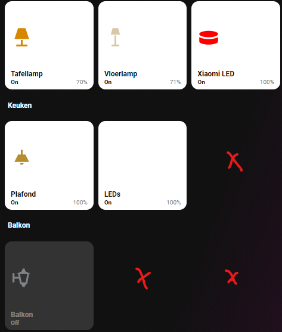
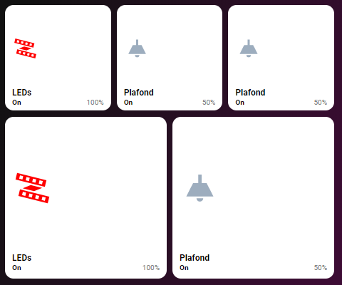

# Homekit Infused

Back to [Addon List](../addon_list.md)

# Empty Button



### Description
Lovelace is great, but unfortunately when not using the same amount of cards in a horizontal-stack it will try to stretch the buttons to fit the full width of the column. This can or will not look great depending on your own preferences (see second screenshot).
To fight this there is this empty button card. It will act as another button with a 1/1 aspect_ratio, however it will be completely transparant (and not clickable). Basically you won't see this at all. (see first screenshot, the x marks where the transparant button is)

### Configuration
- You will have to put this piece of code inside of a horizontal-stack
- You can also use this as a filler for the bottom of a view (e.g. in some cases the buttons touch the footer and it would be nicer to have a gap instead)

### Install
- This card is only useful inside a horizontal-stack or at the bottom of a view!
- Copy the code wherever you need this

```
- !include ../../../base/includes/empty-button.yaml
```

### Extra Information
```
# example of a row with 3 buttons
- type: horizontal-stack
  cards:
    - !include ../../../base/includes/gap.yaml
    - type: entity-button
      entity: light.livingroom_lamp_1
    - type: entity-button
      entity: light.livingroom_lamp_2
    - type: entity-button
      entity: light.livingroom_lamp_3
    - !include ../../../base/includes/gap.yaml
```
```
# example of a row with 2 button and an empty button
- type: horizontal-stack
  cards:
    - !include ../../../base/includes/gap.yaml
    - type: entity-button
      entity: light.livingroom_lamp_1
    - type: entity-button
      entity: light.livingroom_lamp_2
    - !include ../../../base/includes/empty-button.yaml
    - !include ../../../base/includes/gap.yaml
```
```
# example of a row with 1 button and 2 empty buttons
- type: horizontal-stack
  cards:
    - !include ../../../base/includes/gap.yaml
    - type: entity-button
      entity: light.livingroom_lamp_1
    - !include ../../../base/includes/empty-button.yaml
    - !include ../../../base/includes/empty-button.yaml
    - !include ../../../base/includes/gap.yaml
```
