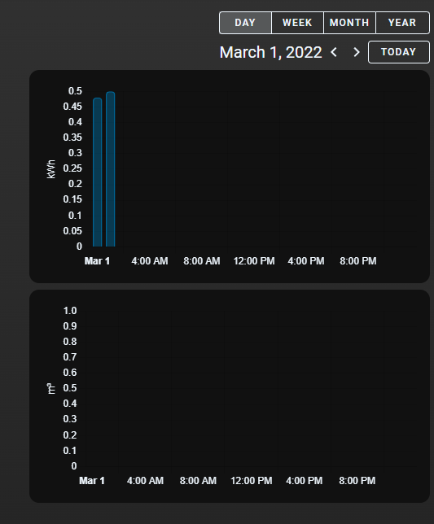
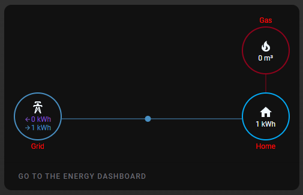
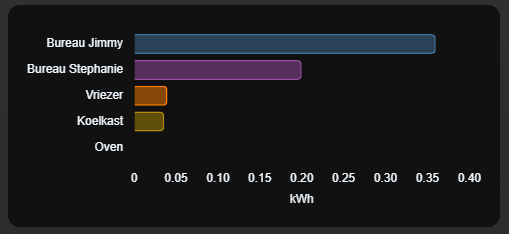

# Homekit Infused 5

## Content
- [Introduction](../index.md)
- [Installation](../installation.md)
- [Configuration](../configuration.md)
- [Addons](../addons.md)
- [Updates](../updates.md)
- [Issues & Questions](../issues.md)
- [About Me](../about.md)
- [Thanks](../thanks.md)

## Addons > Energy

This addon gives your view a wide range of different core energy cards.

*NOTE: For more screenshots of what the options below look like, you can refer to the [official HA documentation](https://www.home-assistant.io/lovelace/energy/). This addon has quite a few different cards check them all out.

You can use any of the following options to modify your addon.

### Stack and Addon Config

| Name | Required | Default | Description |
|----------------------------------|-------------|----------------------|-----------------------------------------------------------------------------------------------------------------------------------------------------------------------------------|
| title | no | undefined | Set the title of the stack, ommitting this line will or setting `title: hide` will hide the title |
| [view_layout](layout.md#view-layout) | no | undefined | This is best used in conjunction with the [layout](layout.md#view-layout) addon, but can also be used to control whether to show this stack on different screen sizes. |
| conditional | no | false | Setting this to `true` will make the stack condtional |
| conditions | no | undefined | Add entities and conditions, this will determine when this addon will be shown, e.g. if entity x is turned `on`, then show this addon (see [addons](../addons.md) for examples |
| energy-date-selection | no | undefined | This card will allow you to pick what data to show. Changing it in this card will influence the data in all other cards. |
| energy-usage-graph | no | undefined | The energy usage graph card shows the amount of energy your house has consumed, and from what source this energy came. It will also show the amount of energy your have returned to the grid. |
| energy-solar-graph | no | undefined | The solar production graph card shows the amount of energy your solar panels have produced per source, and if setup and available the forecast of the solar production. |
| energy-gas-graph | no | undefined | The gas consumption graph card shows the amount of gas consumed per source. |
| energy-sources-table | no | undefined | The energy sources table card shows all your energy sources, and the corresponding amount of energy. If setup, it will also show the costs and compensation per source and the total |
| energy-grid-neutrality-gauge | no | undefined | The grid neutrality gauge card represents your energy dependency. If the needle is in the purple, you returned more energy to the grid than you consumed from it. If it’s in the blue, you consumed more energy from the grid than you returned |
| energy-solar-consumed-gauge | no | undefined | The solar consumed gauge represents how much of the solar energy was not used by your home and was returned to the grid. If you frequently return a lot, try to conserve this energy by installing a battery or buying an electric car to charge |
| energy-carbon-consumed-gauge | no | undefined | The carbon consumed gauge card represents how much of the energy consumed by your home was generated using non-fossil fuels like solar, wind and nuclear. It includes the solar energy you generated your self |
| energy-devices-graph | no | undefined | The devices energy graph show the energy usage per device, it is sorted by usage |
| energy-distribution | no | undefined | The energy distribution card shows how the energy flowed, from the grid to your house, from your solar panels to your house and/or back to the grid. If setup, it will also tell you how many kWh of the energy you got from the grid was produced without using fossil fuels. If you set link_dashboard to true, the card will include a link to the energy dashboard |
| energy-water-graph | no | undefined | The water consumption graph card shows the amount of water consumed per source. |
| link_dashboard | no | false | Add this to your card to create a shortcut to your energy dashboard (this only works when using the `energy-distribution` type)

```yaml
# views.yaml (example)
  my_view:
    addons:
      energy:
        - title: Energy Date Select
          type: energy-date-selection
        - title: Energy Usage
          type: energy-usage-graph
``` 
```yaml
# views.yaml (example of everything)
  my_view:
    addons:
      energy:
        - title: Energy Date Select
          type: energy-date-selection
        - title: Energy Usage
          type: energy-usage-graph
        - title: Energy Solar
          type: energy-solar-graph
        - title: Energy Gas
          type: energy-gas-graph
        - title: Energy Distribution with link
          type: energy-distribution
          link_dashboard: true
        - title: Energy Distribution without link
          type: energy-distribution
        - title: Energy Sources
          type: energy-sources-table
        - title: Grid Neutrality
          type: energy-grid-neutrality-gauge
        - title: Solar Consumed
          type: energy-solar-consumed-gauge
        - title: Carbon Consumed
          type: energy-carbon-consumed-gauge
        - title: Energy Devices
          type: energy-devices-graph
```
```yaml
# views.yaml (example no title)
  my_view:
    addons:
      energy:
        - type: energy-date-selection
# or
  my_view:
    addons:
      energy:
        - title: hide
          type: energy-date-selection
```

### Images:






