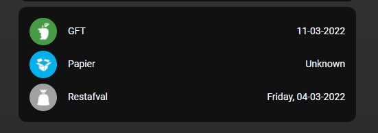

# Homekit Infused 5

## Content
- [Introduction](../index.md)
- [Installation](../installation.md)
- [Configuration](../configuration.md)
- [Addons](../addons.md)
- [Updates](../updates.md)
- [Issues & Questions](../issues.md)
- [About Me](../about.md)
- [Thanks](../thanks.md)

## Addons > Entities

This addon gives your view a core entities card with ALL of the options available.

You can use any of the following options to modify your addon.

### Stack and Addon Config

| Name | Required | Default | Description |
|----------------------------------|-------------|----------------------|-----------------------------------------------------------------------------------------------------------------------------------------------------------------------------------|
| title | no | undefined | Set the title of the stack, ommitting this line will or setting `title: hide` will hide the title |
| [view_layout](layout.md#view-layout) | no | undefined | This is best used in conjunction with the [layout](layout.md#view-layout) addon, but can also be used to control whether to show this stack on different screen sizes. |
| type | no | undefined | Setting a type can make the stack condtional, this option will ONLY accept `conditional` |
| conditions | no | undefined | Add entities and conditions, this will determine when this addon will be shown, e.g. if entity x is turned `on`, then show this addon (see [addons](../addons.md) for examples |
| entities | yes | list of entities | Set your entity/entities here, you can define more than one entity per card |

The documentation on this page is only a quick way to set it up, however you can use all the options available in the [OFFICIAL DOCUMENTATION](https://www.home-assistant.io/lovelace/entities/#options-for-entities).

```yaml
# views.yaml (example)
  my_view:
    addons:
      entities:
        - title: Waste Collection
          entities:
            - sensor.mijnafvalwijzer_gft
            - sensor.mijnafvalwijzer_papier
            - sensor.mijnafvalwijzer_restafval
``` 
```yaml
# views.yaml (example with extra features)
  my_view:
    addons:
      entities:
        - title: My entities stack
          entities:
            - type: button
              icon: mdi:power
              name: Bed light transition
              action_name: Toggle light
              tap_action:
                action: call-service
                service: light.toggle
                service_data:
                  entity_id: light.bed_light
                  transition: 10
            - type: divider
            - type: attribute
              entity: sun.sun
              attribute: elevation
              name: Sun elevation
              prefix: "~"
              suffix: Units
``` 

### Images:


