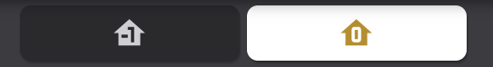

# Homekit Infused

Back to [Addon List](../addon_list.md)

# Floor Selector
*Homekit Infused Framework 3.5.1 or higher required



### Description
This is the floor selector shown on the lights and devices view. You can change the amount of floors by copy/pasting the code below.
Experienced HA users can change this card into anything they'd like (it doesn't even need to be a floor selector!)

### Configuration
- This addon is already preinstalled with the maximum amount of floors, change the code with the code below if you have less floors
- If you only use 1 floor you can simply hide the floor selector in the HKI settings
- You can find the code for the floor selector in the `user/views/floor-selector` folder
- Please change the parameters you need to set below if you do need to change something

### Advanced

| Properties | Required | Default | Description |
|----------------------------------|-------------|----------------------------------|----------------------------------------------------------------------------------------------------------------------------------------------------------------------|
| option | yes | none | Sets the floor number (choose from 0 to 4) |
| icon | yes | none | Sets the icon of the button |
| aspect_ratio | yes | none | Sets the aspect ratio of the button, change this if the buttons are too small or too large |

### Install
- Copy/paste the code below to reflect your own situation, you can simply copy/paste and overwrite the existing code.
```
# example 2 floors
- type: horizontal-stack
  cards:
    - !include
      - '../../../base/templates/button/input-select-button.yaml'
      - entity: input_select.floor_selector
        option: 0
        icon: mdi:home-floor-negative-1
        aspect_ratio: 4/1
    - !include
      - '../../../base/templates/button/input-select-button.yaml'
      - entity: input_select.floor_selector
        option: 1
        icon: mdi:home-floor-0
        aspect_ratio: 4/1
```
```
# example 3 floors
- type: horizontal-stack
  cards:
    - !include
      - '../../../base/templates/button/input-select-button.yaml'
      - entity: input_select.floor_selector
        option: 0
        icon: mdi:home-floor-negative-1
        aspect_ratio: 3/1
    - !include
      - '../../../base/templates/button/input-select-button.yaml'
      - entity: input_select.floor_selector
        option: 1
        icon: mdi:home-floor-0
        aspect_ratio: 3/1
    - !include
      - '../../../base/templates/button/input-select-button.yaml'
      - entity: input_select.floor_selector
        option: 2
        icon: mdi:home-floor-1
        aspect_ratio: 3/1
```
```
# example 4 floors
- type: horizontal-stack
  cards:
    - !include
      - '../../../base/templates/button/input-select-button.yaml'
      - entity: input_select.floor_selector
        option: 0
        icon: mdi:home-floor-negative-1
        aspect_ratio: 2/1
    - !include
      - '../../../base/templates/button/input-select-button.yaml'
      - entity: input_select.floor_selector
        option: 1
        icon: mdi:home-floor-0
        aspect_ratio: 2/1
    - !include
      - '../../../base/templates/button/input-select-button.yaml'
      - entity: input_select.floor_selector
        option: 2
        icon: mdi:home-floor-1
        aspect_ratio: 2/1
    - !include
      - '../../../base/templates/button/input-select-button.yaml'
      - entity: input_select.floor_selector
        option: 3
        icon: mdi:home-floor-2
        aspect_ratio: 2/1
```
```
# example 5 floors
- type: horizontal-stack
  cards:
    - !include
      - '../../../base/templates/button/input-select-button.yaml'
      - entity: input_select.floor_selector
        option: 0
        icon: mdi:home-floor-negative-1
        aspect_ratio: 1/1
    - !include
      - '../../../base/templates/button/input-select-button.yaml'
      - entity: input_select.floor_selector
        option: 1
        icon: mdi:home-floor-0
        aspect_ratio: 1/1
    - !include
      - '../../../base/templates/button/input-select-button.yaml'
      - entity: input_select.floor_selector
        option: 2
        icon: mdi:home-floor-1
        aspect_ratio: 1/1
    - !include
      - '../../../base/templates/button/input-select-button.yaml'
      - entity: input_select.floor_selector
        option: 3
        icon: mdi:home-floor-2
        aspect_ratio: 1/1
    - !include
      - '../../../base/templates/button/input-select-button.yaml'
      - entity: input_select.floor_selector
        option: 3
        icon: mdi:home-floor-3
        aspect_ratio: 1/1
```
