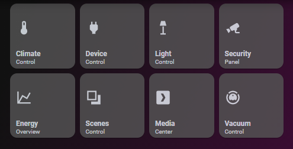

# Homekit Infused

Back to [Addon List](../addon_list.md)

# Frontpage Buttons



### Description
This is the default HKI frontpage navigation row. 

### Configuration
- For detailed instructions on how to use this, please read the [button (navigation)](button-navigation.md) documentation!
- If you use the default config (the config below) then no additional config is required, you can simply copy and paste this to your own setup.

### Advanced
For detailed instructions on how to use this, please follow read the [button (navigation)](button-navigation.md) documentation!

### Install
- Create a new file inside the folder of the view you want (e.g. /homekit-infused/user/views/frontpage/), you can name the file however you want (e.g. frontpage-buttons.yaml)
- Copy the code below and make changes if needed

```
- type: custom:layout-card
  column_num: 4
  justify_content: start
  layout: horizontal
  cards:  
    - !include
      - '../../../base/templates/button/button-badge.yaml'
      - name: Climate
        label: Control
        icon: mdi:thermometer
        navigation_path: /homekit-infused/climate
        notification: "[[[ if (states['input_number.empty'].state == 0) return '&nbsp'; else return `${states['input_number.empty'].state}`; ]]]"
        background_color: "[[[ if (states['input_number.empty'].state == 0) return 'rgba(0,0,0,0.0)'; else return 'var(--paper-item-icon-color)'; ]]]"   
    - !include
      - '../../../base/templates/button/button-badge.yaml'
      - name: Devices
        label: Overview
        icon: mdi:power-plug
        navigation_path: /homekit-infused/devices
        notification: "[[[ if (states['input_number.empty'].state == 0) return '&nbsp'; else return `${states['input_number.empty'].state}`; ]]]"
        background_color: "[[[ if (states['input_number.empty'].state == 0) return 'rgba(0,0,0,0.0)'; else return 'var(--paper-item-icon-color)'; ]]]"                                             
    - !include
      - '../../../base/templates/button/button-badge.yaml'
      - name: Lights
        label: Overview
        icon: mdi:floor-lamp
        navigation_path: /homekit-infused/lights
        notification: "[[[ if (states['input_number.empty'].state == 0) return '&nbsp'; else return `${states['input_number.empty'].state}`; ]]]"
        background_color: "[[[ if (states['input_number.empty'].state == 0) return 'rgba(0,0,0,0.0)'; else return 'var(--paper-item-icon-color)'; ]]]"   
    - !include
      - '../../../base/templates/button/button-badge.yaml'
      - name: Security
        label: Panel
        icon: mdi:cctv
        navigation_path: /homekit-infused/security
        notification: "[[[ if (states['input_number.empty'].state == 0) return '&nbsp'; else return `${states['input_number.empty'].state}`; ]]]"
        background_color: "[[[ if (states['input_number.empty'].state == 0) return 'rgba(0,0,0,0.0)'; else return 'var(--paper-item-icon-color)'; ]]]" 
    - !include
      - '../../../base/templates/button/button-badge.yaml'
      - name: Energy
        label: Overview
        icon: mdi:chart-line
        navigation_path: /homekit-infused/energy
        notification: "[[[ if (states['input_number.empty'].state == 0) return '&nbsp'; else return `${states['input_number.empty'].state}`; ]]]"
        background_color: "[[[ if (states['input_number.empty'].state == 0) return 'rgba(0,0,0,0.0)'; else return 'var(--paper-item-icon-color)'; ]]]" 
    - !include
      - '../../../base/templates/button/button-badge.yaml'
      - name: Scenes
        label: Overview
        icon: mdi:arrange-send-backward
        navigation_path: /homekit-infused/scenes
        notification: "[[[ if (states['input_number.empty'].state == 0) return '&nbsp'; else return `${states['input_number.empty'].state}`; ]]]"
        background_color: "[[[ if (states['input_number.empty'].state == 0) return 'rgba(0,0,0,0.0)'; else return 'var(--paper-item-icon-color)'; ]]]"  
    - !include
      - '../../../base/templates/button/button-badge.yaml'
      - name: Media
        label: Center
        icon: mdi:plex
        navigation_path: /homekit-infused/media
        notification: "[[[ if (states['input_number.empty'].state == 0) return '&nbsp'; else return `${states['input_number.empty'].state}`; ]]]"
        background_color: "[[[ if (states['input_number.empty'].state == 0) return 'rgba(0,0,0,0.0)'; else return 'var(--paper-item-icon-color)'; ]]]"     
    - !include
      - '../../../base/templates/button/button-badge.yaml'
      - name: Vacuum
        label: Control
        icon: mdi:robot-vacuum
        navigation_path: /homekit-infused/vacuum
        notification: "[[[ if (states['input_number.empty'].state == 0) return '&nbsp'; else return `${states['input_number.empty'].state}`; ]]]"
        background_color: "[[[ if (states['input_number.empty'].state == 0) return 'rgba(0,0,0,0.0)'; else return 'var(--paper-item-icon-color)'; ]]]"    
```
