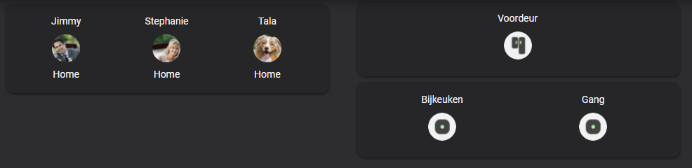

# Homekit Infused

Back to [Addon List](../addon_list.md)

# Frontpage Glances



### Description
This is an easy to use glance card to track which door/window/motion/smoke sensors are on (the cards will hide when they are off). There is also a possibility for a person card which shows you in a glance who is where.

### Configuration
Open your `customize.yaml` file and add the following attribute to your sensor entities. If you don't have your entities in this file yet then you must create them first. The attribute you will need to add is depends on the type you want to use, you can set the following types:
```
type: door (for doors)
type: window (for windows)
type: motion (for motion sensors)
type: gas (for gas sensors)
type: smoke (for smoke sensors)
```
Here is an example on how to set the types
```
sensor.living_room_temperature:
  friendly_name: Living Room
  type: temperature

binary_sensor.living_room_motion:
  friendly_name: Living Room
  type: motion
```
Here is an example of how to get images attached to persons (starting from HA 0.115.x you can also do this in the UI)
```
person.jimmy:
  friendly_name: Jimmy
  entity_picture: /local/images/persons/jimmy.png
```
*note: an entity can not have two types, HKI auto filled cards work by filtering the type attribute. This means you can not have an entity auto filled on two views. You can however always create a custom button to do this.

### Advanced

| Properties | Required | Default | Description |
|----------------------------------|-------------|----------------------------------|----------------------------------------------------------------------------------------------------------------------------------------------------------------------|
| type (attributes) | yes | none | Sets the type to show, choose from the types mentioned in the configuration section of this documentation |
| state | no | 'on' | Entities will only show when it matches this state |
| method | yes | name | Sorts the cards in a different order, choose from: domain, entity_id, name, state, attribute, last_changed last_updated or last_triggered |
| show_state | yes | false | Show the state current state on the glance (takes more screenspace, since you are probably going to use this to show which doors are open, it's probably to leave this to false since we already know they are open when they show up on the card) |

### Install
- Create a new file inside the folder of the view you want (e.g. /homekit-infused/user/views/frontpage/), you can name the file however you want (e.g.frontpage-photos-card.yaml)
- Copy the code below and make changes if needed

```
# example of a door sensor glance card
- type: custom:auto-entities
  filter:
    include:
      - attributes:
          type: door
        state: 'on'
  show_empty: false
  sort:
    method: last_changed 
    numeric: false
  card:
    type: glance
    style: |
      ha-card {
        border-radius: var(--border-radius);
        box-shadow: var(--box-shadow);
      }
    show_state: false
```
```
# example of a person glance card
- type: custom:auto-entities
  filter:
    include:
      - entity_id: 'person.*'
  show_empty: false
  sort:
    method: name 
    numeric: false
  card:
    type: glance
    style: |
      ha-card {
        border-radius: var(--border-radius);
        box-shadow: var(--box-shadow);
      }
    show_state: true
```
Notice the show_state: true in the second example. Since we want to show where people are, we can leave this to true.
If you only want to track people that are home (or away) do it like the following example:
```
# example of a person glance card
- type: custom:auto-entities
  filter:
    include:
      - entity_id: 'person.*'
        state: 'home'
  show_empty: false
  sort:
    method: name 
    numeric: false
  card:
    type: glance
    style: |
      ha-card {
        border-radius: var(--border-radius);
        box-shadow: var(--box-shadow);
      }
    show_state: false
```
Notice I choose the show_state to be false, since I already know that anything that's going to show up on this card is 'home' there is no need to also mention the state.
