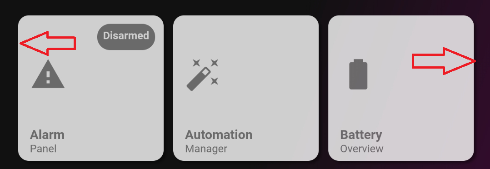

# Homekit Infused
*HKI Framework 3.4.0 or higher required!

Back to [Addon List](../addon_list.md)

# Gap


### Description
By default lovelace doesn't create gaps between the left and right side of the screen, this will not look great for some people when viewed on a smartphone, to combat this there was a gap card in previous versions which was basically just a transparant button without actions. Obviously this method wasn't very nice and clean. So now we'll do this with CSS instead. See examples below. Added bonus, with gaps it also looks better on tablets/browsers. However since gap-card is no longer used, people that prefer the edge to edge look of standard lovelace can now do so!

### Configuration
- Wrap your cards inside of the code below
- You can entirely choose how wide the gaps should be by adjusting the amount of pixels. More pixels means a wider gap.

### Install
- Copy the code wherever you need this

```
- type: custom:mod-card
  style: |
    ha-card {
      margin-left: 7px;
      margin-right: 7px;
    }
  card:
```

### Extra Information
```
# example of a markdown-card without gaps at the sides
- type: markdown
  content: this is a card without gaps
```
```
# example of a markdown-card with gaps
- type: custom:mod-card
  style: |
    ha-card {
      margin-left: 7px;
      margin-right: 7px;
    }
  card:
    type: markdown
    content: this is card with gaps
```
```
# example of a 6-button-stack without gaps
- type: vertical-stack
  cards:
    - type: horizontal-stack
      cards:
        - type: button
          entity: light.light_1
        - type: button
          entity: light.light_2
        - type: button
          entity: light.light_3
    - type: horizontal-stack
      cards:
        - type: button
          entity: light.light_4
        - type: button
          entity: light.light_5
        - type: button
          entity: light.light_6
```
```
# example of a 6-button-stack with gaps
- type: custom:mod-card
  style: |
    ha-card {
      margin-left: 7px;
      margin-right: 7px;
    }
  card:
    type: vertical-stack
    cards:
      - type: horizontal-stack
        cards:
          - type: button
            entity: light.light_1
          - type: button
            entity: light.light_2
          - type: button
            entity: light.light_3
      - type: horizontal-stack
        cards:
          - type: button
            entity: light.light_4
          - type: button
            entity: light.light_5
          - type: button
            entity: light.light_6
```
### Advanced
Sometimes you will only need a single card, when using a single card we can avoid using the mod-card and style it directly into the cards styles. This is only ever useful when using one single card in the horizontal space. When using two cards horizontally we are using a horizontal-stack and we should use a mod-card around the horizontal-stack instead! (Experienced users could style the cards separately, see last example)
```
# example of a single card without gaps
- type: entities
  entities:
    - light.light_1
    - light.light_2
    - light.light_3
```
```
# example of a single card with gaps, but without mod-card
- type: entities
  style: |
    ha-card {
      margin-left: 7px;
      margin-right: 7px;
    }
  entities:
    - light.light_1
    - light.light_2
    - light.light_3
```
```
# example of two cards with gaps, but without mod-card
- type: horizontal-stack
  cards:
    - type: entities
      style: |
        ha-card {
          margin-left: 7px;
        }
      entities:
        - light.light_1
        - light.light_2
        - light.light_3
    - type: entities
      style: |
        ha-card {
          margin-right: 7px;
        }
      entities:
        - light.light_1
        - light.light_2
        - light.light_3
```
