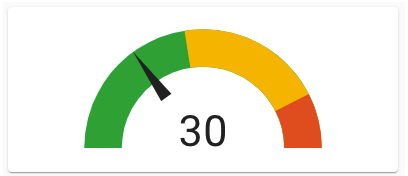

# Homekit Infused 5

## Content
- [Introduction](../index.md)
- [Installation](../installation.md)
- [Configuration](../configuration.md)
- [Addons](../addons.md)
- [Updates](../updates.md)
- [Issues & Questions](../issues.md)
- [About Me](../about.md)
- [Thanks](../thanks.md)

## Addons > Gauge Card

This addon gives your view a core gauge card that shows a simple gauge for an entity (or multiple entities).

You can use any of the following options to modify your addon.

### Stack Config

| Name | Required | Default | Description |
|----------------------------------|-------------|----------------------|-----------------------------------------------------------------------------------------------------------------------------------------------------------------------------------|
| title | no | undefined | Set the title of the stack, ommitting this line will or setting `title: hide` will hide the title |
| columns | no | 1 | Set the number of gauges this stack will show horizontally |
| [view_layout](layout.md#view-layout) | no | undefined | This is best used in conjunction with the [layout](layout.md#view-layout) addon, but can also be used to control whether to show this stack on different screen sizes. |
| type | no | undefined | Setting a type can make the stack condtional, this option will ONLY accept `conditional` |
| conditions | no | undefined | Add entities and conditions, this will determine when this addon will be shown, e.g. if entity x is turned `on`, then show this addon (see [addons](../addons.md) for examples |
| entities | yes | undefined | Set your entity/entities here, you can define more than one entity per card |

### Gauge Extra Options
The recommended method to change icons and/or friendly names is by the use of customize.yaml, however this is not always adequate enough for the customizations that we might want, you can pass any of the options below to your entity to customize the look and feel.

By default you must enter an array of entities like in the examples below, this does not need extra options and will just get the global name/icon.
You must define it as an object instead to make use of the options below. See examples.

| Name | Required | Default | Description |
|----------------------------------|-------------|----------------------|-----------------------------------------------------------------------------------------------------------------------------------------------------------------------------------|
| entity | yes | undefined | Set the entity used make sure to put `entity:` in the list and then the actual entity see example below |
| name | no | global_name | Set a custom name for this entity |
| unit | no | unit defined by entity | This will set the measurement unit this gauge |
| min | no | unit defined by entity | This will set the minimum number to show this gauge |
| max | no | unit defined by entity | This will set the maximum number to show this gauge |
| severity | no | undefined | You can have colors shown on different severities for this gauge, you MUST use all three option `red`, `yellow` and `green` (see example below) |

```yaml
# views.yaml (example)
  my_view:
    addons:
      gauge:
        - title: Gauges
          columns: 3
          entities:
            - sensor.unifi_gateway_mem
            - sensor.memory_use_percent
``` 
```yaml
# views.yaml (example with severity)
  my_view:
    addons:
      gauge:
        - title: Gauges
          columns: 2
          entities:
            - entity: sensor.unifi_gateway_mem
              name: UDM Memory
              severity:
                red: 90
                yellow: 60
                green: 10
```
```yaml
# views.yaml (example mixed)
  my_view:
    addons:
      gauge:
        - title: Gauges
          columns: 2
          entities:
            - entity: sensor.unifi_gateway_mem
              name: UDM Memory
              severity:
                red: 90
                yellow: 60
                green: 10
            - sensor.memory_use_percent
            - sensor.cpu_use_percent
```

### Images:


