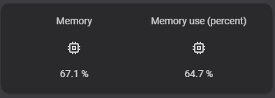
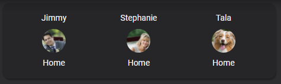
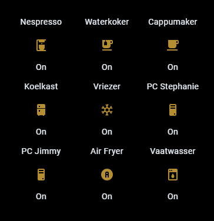

# Homekit Infused 5

## Content
- [Introduction](../index.md)
- [Installation](../installation.md)
- [Configuration](../configuration.md)
- [Addons](../addons.md)
- [Updates](../updates.md)
- [Issues & Questions](../issues.md)
- [About Me](../about.md)
- [Thanks](../thanks.md)

## Addons > Glance Card

This addon gives your view a core glance card.

You can use any of the following options to modify your addon.

| Name | Required | Default | Description |
|----------------------------------|-------------|----------------------|-----------------------------------------------------------------------------------------------------------------------------------------------------------------------------------|
| title | no | undefined | Set the title of the stack, ommitting this line will or setting `title: hide` will hide the title |
| show_name | no | true | Choose whether to show the name of the entity |
| show_icon | no | true | Choose whether to show the icon of the entity |
| show_state | no | true | Choose whether to show the state of the entity |
| columns | no | auto | Choose how many columns you want this card to have, if omitted than it will choose the column size automatically |
| state_color | no | true | Choose whether to show a different color when the state is `on`, just like a light button would show |
| [view_layout](layout.md#view-layout) | no | undefined | This is best used in conjunction with the [layout](layout.md#view-layout) addon, but can also be used to control whether to show this stack on different screen sizes. |
| entities | yes | list of entities | Set your entity/entities here, you can define more than one entity per card |

```yaml
# views.yaml (example)
  my_view:
    addons:
      glance:
        - title: Waste Collection
          columns: 3
          show_name: false
          entities:
            - sensor.mijnafvalwijzer_gft
            - sensor.mijnafvalwijzer_papier
            - sensor.mijnafvalwijzer_restafval
``` 

### Images:






