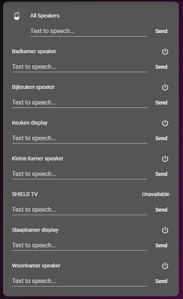

# Homekit Infused

Back to [Addon List](../addon_list.md)

# Google Home Card


### Description
This card is used to create a quick google home speaker card

### Requirements (HACS)

| Name | Type  | Description |
|----------------------------------|-------------|---------------------------------------------------------------------------------------------------------------------------------------------------------------------------------------------------------|
| [Mini Media Player](https://github.com/kalkih/mini-media-player) | Frontend | This is a minimalistic media player |

### Resources
Add the following lines to your lovelace resources 
```
/hacsfiles/mini-media-player/mini-media-player-bundle.js
```

### Configuration
Create two groups in your own group configuration in `configuration.yaml`. Then add the following 2 groups, the first group is used to enter the all speakers cast group. You can create this group by opening Google Home and then create a speaker group (I will suggest selecting all the speakers and name the group `All Speakers` or something like that, you might need to restart HA to get the entity). The second group is used to put all the google home speakers you have, note that you can ONLY use speakers that can otherwise be grouped by the Google Home app. If you create a speaker group in the Google Home app and your speaker is not listed, then this will also not work in this card!

Additionally if you do not know how to add this to your configuration.yaml or have any troubles with it you can simply copy the code below, create a new file (e.g. google-home.yaml) and drop this file inside of the packages folder (this will NOT be overwritten by an update!)
```
group:
  google_home_all_speakers: media_player.all_speakers
  google_home:
    - media_player.badkamer_speaker
    - media_player.bijkeuken_speaker
    - media_player.home_group
    - media_player.keuken_display
    - media_player.kleine_kamer_speaker
```
- No additional config required

### Install
- Create a new file inside the folder of the view you want (e.g. /homekit-infused/user/views/location/), you can name the file however you want (e.g. title-text-card.yaml)
- Copy the code below and make changes if needed

```
- type: custom:auto-entities
  filter:
    include:
      - group: group.google_home_all_speakers
        options:
          type: custom:mini-media-player
          entity: this.entity_id
          group: true
          source: icon
          icon: mdi:google-home
          info: short
          tts:
            platform: google_translate
          hide:
            volume: false
            power: true
      - group: group.google_home
        options:
          type: custom:mini-media-player
          entity: this.entity_id
          group: true
          tts:
            platform: google_translate
          hide:
            icon: true
            volume: false
            controls: true
  show_empty: false
  sort:
    method: name
    numeric: true
  card:
    type: entities
    style: |
      ha-card {
        border-radius: var(--border-radius);
        box-shadow: var(--box-shadow);
      }
    show_header_toggle: false
```
