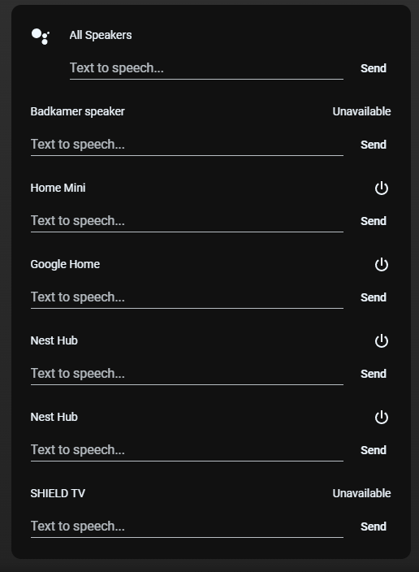

# Homekit Infused 5

## Content
- [Introduction](../index.md)
- [Installation](../installation.md)
- [Configuration](../configuration.md)
- [Addons](../addons.md)
- [Updates](../updates.md)
- [Issues & Questions](../issues.md)
- [About Me](../about.md)
- [Thanks](../thanks.md)

## Addons > Google

This addon gives your view a simple Google TTS card.

You can use any of the following options to modify your addon.

### HACS Requirements

| Name | Type  | Description |
|----------------------------------|-------------|---------------------------------------------------------------------------------------------------------------------------------------------------------------------------------------------------------|
| [Mini Media Player](https://github.com/kalkih/mini-media-player) | Frontend | This is a very feature rich media player card, it is only used in a simple form for this addon, but you can use the custom addon to go wild with this card |

### Stack and Addon Config

| Name | Required | Default | Description |
|----------------------------------|-------------|----------------------|-----------------------------------------------------------------------------------------------------------------------------------------------------------------------------------|
| title | no | undefined | Set the title of the stack, ommitting this line will or setting `title: hide` will hide the title |
| speaker_group | no | undefined | Set a group entity (useful if you want to control multiple entities at once) |
| [view_layout](layout.md#view-layout) | no | undefined | This is best used in conjunction with the [layout](layout.md#view-layout) addon, but can also be used to control whether to show this stack on different screen sizes. |
| type | no | undefined | Setting a type can make the stack condtional, this option will ONLY accept `conditional` |
| conditions | no | undefined | Add entities and conditions, this will determine when this addon will be shown, e.g. if entity x is turned `on`, then show this addon (see [addons](../addons.md) for examples |
| entities | yes | array | Add the entities you want in your stack, entities must be listed as an array and must be in the media_player domain |

```yaml
# views.yaml (example)
  my_view:
    addons:
      google: 
        - title: Google Home
          speaker_group: media_player.all_speakers
          entities:
            - media_player.badkamer_speaker
            - media_player.bijkeuken_speaker
            - media_player.woonkamer_speaker
```

### Images:


