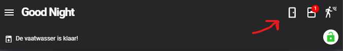

# Homekit Infused

Back to [Addon List](../addon_list.md)

# Header Sensor Icons


### Description
These are the header sensor icons, they can be adjusted but the changes won't be persistent. This documentation shows you how to change the sensors to something else and how to add more. This change will unfortunately NOT be persistent. It will be overwritten in any update that has changes to this header template file. If you edit this (beyond the default settings) then I will suggest keeping a backup of this file at all times.

### Configuration
- To use this you can simply comment/uncomment the code you want to use
- You can also add your own entities, though I would not recommend this for non-experienced users.

### Advanced

| Properties | Required | Default | Description |
|----------------------------------|-------------|----------------------------------|----------------------------------------------------------------------------------------------------------------------------------------------------------------------|
| icon | yes | mdi:door | Sets the icon to be used for this sensor |
| background_color | yes | none | You must set this to the sensor entity that is used to count the amount of devices that are currently in use, advanced users could change the color, but I recommend only changing the sensor entity! |
| badge | yes | none | You must set this to the sensor entity that is used to count the amount of devices that are currently in use, advanced users could change the color, but I recommend only changing the sensor entity! |
| entity | yes | group.all_door_sensors | This is a group to show you the amount of devices currently in use inside of a popup window, when you are using entities that are custom made by you, you will need to create your own group! |


### How to
To change the header sensors you must open the following file `/homekit-infused/base/templates/header/header-base-template.yaml`
You can find out which sensors are included by default in HKI, if you did the initial HKI setup correctly you should have most of these working for you already! Please check out more information [HERE](device_counters.md)

You can safely comment out the icons you don't want/need/use and/or add more yourself in a way described below.

```
# Default (3 icons)
- !include
  - '../../templates/header/sensor-icons.yaml'
  - icon: mdi:door
    background_color: "[[[ if (states['sensor.current_doors_open'].state > 0) return 'red'; else return 'rgba(0,0,0,0.0)' ]]]"
    badge: "[[[ if (states['sensor.current_doors_open'].state > 0) return states['sensor.current_doors_open'].state; else return '&nbsp;'; ]]]"
    size: 100%
    entity: group.all_door_sensor_entities 
- !include
  - '../../templates/header/sensor-icons.yaml'
  - icon: mdi:window-closed
    background_color: "[[[ if (states['sensor.current_windows_open'].state > 0) return 'red'; else return 'rgba(0,0,0,0.0)' ]]]"
    badge: "[[[ if (states['sensor.current_windows_open'].state > 0) return states['sensor.current_windows_open'].state; else return '&nbsp;'; ]]]"
    entity: group.all_window_sensor_entities
- !include
  - '../../templates/header/sensor-icons.yaml'
  - icon: mdi:motion-sensor
    background_color: "[[[ if (states['sensor.current_motion_sensors_on'].state > 0) return 'red'; else return 'rgba(0,0,0,0.0)' ]]]"
    badge: "[[[ if (states['sensor.current_motion_sensors_on'].state > 0) return states['sensor.current_motion_sensors_on'].state; else return '&nbsp;'; ]]]"
    entity: group.all_motion_sensor_entities
```
```
# For Large Screens (5 icons)
- !include
  - '../../templates/header/sensor-icons.yaml'
  - icon: mdi:door
    background_color: "[[[ if (states['sensor.current_doors_open'].state > 0) return 'red'; else return 'rgba(0,0,0,0.0)' ]]]"
    badge: "[[[ if (states['sensor.current_doors_open'].state > 0) return states['sensor.current_doors_open'].state; else return '&nbsp;'; ]]]"
    size: 100%
    entity: group.all_door_sensor_entities 
- !include
  - '../../templates/header/sensor-icons.yaml'
  - icon: mdi:window-closed
    background_color: "[[[ if (states['sensor.current_windows_open'].state > 0) return 'red'; else return 'rgba(0,0,0,0.0)' ]]]"
    badge: "[[[ if (states['sensor.current_windows_open'].state > 0) return states['sensor.current_windows_open'].state; else return '&nbsp;'; ]]]"
    entity: group.all_window_sensor_entities
- !include
  - '../../templates/header/sensor-icons.yaml'
  - icon: mdi:motion-sensor
    background_color: "[[[ if (states['sensor.current_motion_sensors_on'].state > 0) return 'red'; else return 'rgba(0,0,0,0.0)' ]]]"
    badge: "[[[ if (states['sensor.current_motion_sensors_on'].state > 0) return states['sensor.current_motion_sensors_on'].state; else return '&nbsp;'; ]]]"
    entity: group.all_motion_sensor_entities
 - !include
   - '../../templates/header/sensor-icons.yaml'
   - icon: mdi:power-plug
     background_color: "[[[ if (states['sensor.current_devices_on'].state > 0) return 'red'; else return 'rgba(0,0,0,0.0)' ]]]"
     badge: "[[[ if (states['sensor.current_devices_on'].state > 0) return states['sensor.current_devices_on'].state; else return '&nbsp;'; ]]]"
     size: 100%
     entity: group.all_device_switch_entities 
 - !include
   - '../../templates/header/sensor-icons.yaml'
   - icon: mdi:lightbulb
     background_color: "[[[ if (states['sensor.current_lights_on'].state > 0) return 'red'; else return 'rgba(0,0,0,0.0)' ]]]"
     badge: "[[[ if (states['sensor.current_lights_on'].state > 0) return states['sensor.current_lights_on'].state; else return '&nbsp;'; ]]]"
     size: 100%
     entity: group.all_light_entities
```
