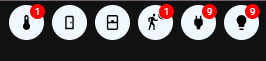

# Homekit Infused 5

## Content
- [Introduction](../index.md)
- [Installation](../installation.md)
- [Configuration](../configuration.md)
- [Addons](../addons.md)
- [Updates](../updates.md)
- [Issues & Questions](../issues.md)
- [About Me](../about.md)
- [Thanks](../thanks.md)

## Header

You can setup some parts of the header in here like which badges to show and whether or not to show the subtitle/notification bar. 
The settings on this page MUST be configured in `/hki-user/config/config.yaml`!

| Name | Required | Default | Description |
|----------------------------------|-------------|----------------------|-----------------------------------------------------------------------------------------------------------------------------------------------------------------------------------|
| show_subtitle | no | true | Choose whether to show the subtitle/notification bar |
| badges | no | list | Set the badges to show in the header, you can have a maximum of 8, delete/comment out badges you don't want |

#### Header Extra Options

| Name | Required | Default | Description |
|----------------------------------|-------------|----------------------|-----------------------------------------------------------------------------------------------------------------------------------------------------------------------------------|
| name | yes | unknown | Set a name to show when opening the popup |
| icon | yes | unknown | Choose an icon to show in the header, this accepts [JS templates](https://github.com/custom-cards/button-card#javascript-templates) |
| icon_color | no | set globally | Set a custom icon color for this badge, this accepts [JS templates](https://github.com/custom-cards/button-card#javascript-templates) |
| entity | yes | unknown | Choose the entity that holds the number of devices that are `on`, you must have created this sensor yourself or use the ones from HKI's [device counters](device-counters.md) |
| badge | 
| group_entity | no | unknown | Choose the group that this entity belongs to, you must have create this sensor yourself or use the ones from HKI's [device counters](device-counters.md) |
| grid_area | yes | see example below | Choose where the button will be placed horizontally. You can choose a number (written in words) between `one` and `eight` |
| [tap_action](https://github.com/custom-cards/button-card#Action) | no | predefined | Set a custom tap_action, see [actions](https://github.com/custom-cards/button-card#Action) for more information, if you set a tap_action the default popup will no longer work and be replaced by this action instead |
| [hold_action](https://github.com/custom-cards/button-card#Action) | no | none | Set a custom hold_action, see [actions](https://github.com/custom-cards/button-card#Action) |
| [double_tap_action](https://github.com/custom-cards/button-card#Action) | no | none | Set a custom double_tap_action, see [actions](https://github.com/custom-cards/button-card#Action), if undefined it will use the same action as set in hold_action |
| popup | no | predefined | Design your own popup when clicking this badge (*Note: Will not work if tap_action is defined!*), this must be a list of cards! See example below |

```yaml
# config.yaml (default and minimum header settings)
  header:
    show_subtitle: true 
    badges: 
      - name: Thermostats
        icon: mdi:thermometer
        entity: sensor.current_climate_entities_on
        group_entity: group.all_climate_entities
        grid_area: six
      - name: Doors
        icon: mdi:door
        entity: sensor.current_doors_open
        group_entity: group.all_door_sensor_entities
        grid_area: five
      - name: Windows
        icon: mdi:window-closed
        entity: sensor.current_windows_open
        group_entity: group.all_window_sensor_entities
        grid_area: four
      - name: Motion
        icon: mdi:motion-sensor
        entity: sensor.current_binary_sensors_on
        group_entity: group.all_binary_sensor_entities
        grid_area: three
      - name: Devices
        icon: mdi:power-plug
        entity: sensor.current_devices_on
        group_entity: group.all_device_switch_entities
        grid_area: two
      - name: Lights
        icon: mdi:lightbulb
        entity: sensor.current_lights_on
        group_entity: group.all_light_entities
        grid_area: one
```
```yaml
# config.yaml (example custom popup)
  header:
    show_subtitle: true 
    badges: 
      - name: Thermostats
        icon: mdi:thermometer
        entity: sensor.current_climate_entities_on
        group_entity: group.all_climate_entities
        grid_area: six
        popup:
          - type: markdown
            content: My thermostat
          - type: thermostat
            entity: climate.office
```

### Images:


